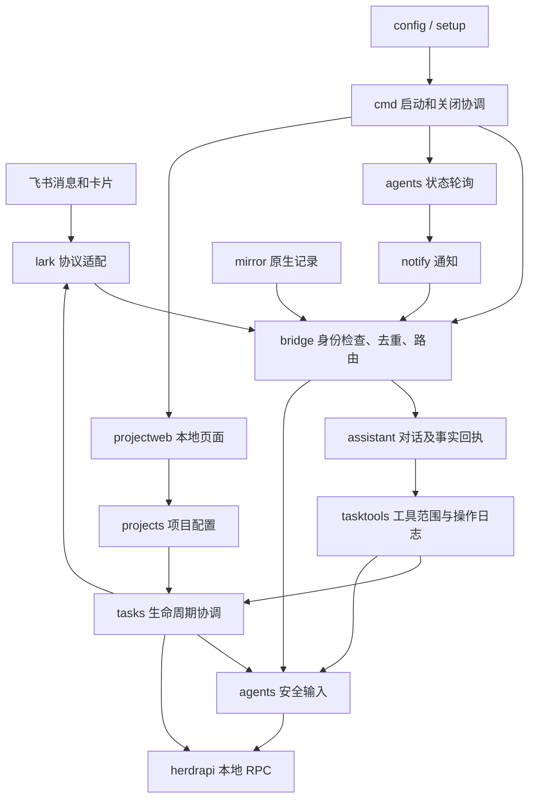

# 代码结构与可靠性审计

> Go 历史参考（基线 [7b75511](https://github.com/hewenyu/herdr-agent/blob/7b7551182bbc7ed962672720f54f7b06072888ee/README.md)）：本文保留旧实现与当时验证记录，不描述当前 Node 程序。当前能力请看 [实施设计](node-pi-design.md) 与 [验收证据](acceptance.md)。文中的 `internal/`、`cmd/` 源码路径均指该固定历史版本。

分支：`audit/architecture-reliability`。基线：`7107d566`（PR #7 合并结果）。
代码修复与共享实现提交：`8175d6b`。

本次审计以本仓库实现、CI，以及本地保留的设计规格和历史实测记录为依据，分为故障复现与修复、相邻路径交叉复查、整体验证三轮。重点是用户可观察的可靠性、授权边界、状态恢复和重复实现。测试通过只能说明已覆盖的行为，不能证明所有远端服务和真实终端交互均正确。

## 结构与设计意图

项目已经从“手机控制已有 agent”扩展为“本机个人任务执行服务”。S1/S2 的非目标描述属于早期版本：例如 S1 不创建会话，现行可选任务层会创建自己管理的会话。本地 `specs/00-ground-truth.md` 的终端输入、事件重投、pane 身份等实测约束仍是理解实现的依据。这些规格含操作者环境信息，按 `.gitignore` 保留在本地，不随本次审计发布；公开约束见代码注释和 README。当前产品范围应同时阅读 README 和 `docs/feishu-ai-integration.md`。



| 模块 | 应承担的职责 | 本次重点检查 |
| --- | --- | --- |
| `cmd/herdr-agent` | CLI、单实例锁、依赖组装、启动权限检查、退出清理 | 配置是否到达执行组件、启动排序、失败释放资源 |
| `config` / `setup` | 加载配置、发现同一飞书应用、补授权和写回凭据 | 凭据优先级、保留已有配置、BOM、错误脱敏 |
| `lark` | SDK 适配、消息/卡片转换、飞书任务和群接口 | 群消息投递、平台错误、真实 SDK 的离线报文测试 |
| `bridge` | 验证用户身份、去重、聊天目标选择、交互卡片与消息回执 | 执行和通知失败的区别、重复输入、私聊与任务群隔离 |
| `assistant` / `tasktools` | 理解请求、绑定身份和任务范围、调用受限工具、输出真实回执 | 模型不得指定身份/任意目录、任务查询范围、副作用日志 |
| `tasks` | 任务意图、执行资源绑定、同步、验收与关闭 | 重启恢复、只读错误、首次投递、agent 身份、清理 |
| `agents` / `herdrapi` | 轮询状态、带 Guard 的输入、有限 RPC 白名单 | 等待后身份变化、读回不确定、订阅时序与取消 |
| `notify` / `mirror` | 主动通知和原生 transcript 转发 | 初始状态遗漏、冷却、输出来源、背压边界 |
| `projects` / `projectweb` | 多目录配置、Git 主目录、本机页面与 API | 配置快照、路径和符号链接、Origin/Host/CSRF、前端文本渲染 |
| `dedup` / `routes` / `selection` | 重投窗口、回复映射、聊天选中目标 | 原子保存、权限、损坏降级与回收 |
| `cards` / `screen` / `commands` / `outbound` | 卡片、屏幕解析、命令及消息格式 | 宽度规则重复、审批结果表达、既有回归 |
| CI / release / deploy | 可重复构建、嵌入前端、三平台二进制交付 | 固定 action 版本、构建和测试命令、独立二进制烟测 |

### 必须保留的约束

1. 本机 herdr 控制相当于本机命令执行；飞书发送者身份必须来自可信事件，模型不能替换身份、群绑定、pane 或任意路径。
2. 外部操作不能与本地 JSON 构成真正的事务。先持久化意图；操作结果不明时暂停并告知用户，不能把“不知道是否成功”当作“可以再执行”。
3. agent 自述、终端读回和系统验证是不同证据。任务完成、agent 一轮结束、请求已登记、群已销毁也是不同状态。
4. 配置目录可以热更新，但已创建任务保留自己的目录和 Bypass 快照。主目录是工作目录，其余目录必须传给实际 agent。
5. 进度和审批在绑定任务群内处理。关闭只清理任务管理器持有的执行资源；代码与任务结果保留。

这些边界总体成立，未发现需要替换技术栈或整体重写的证据。主要缺陷集中在等待/重试、错误分层和两条正常路径交汇的地方。

## 已确认的问题与修复

优先级含义：P1 为可能重复执行、误用执行目标或破坏已有绑定的正确性风险；P2 为状态、恢复、通知和配置行为错误。以下回归均使用临时目录、假平台或本地受控输入，不触碰正在运行的真实任务。

| 编号 | 级别 | 触发与后果 | 修复与证据 |
| --- | --- | --- | --- |
| A01 | P1 | `Say`/`Interrupt` 已尝试写终端，随后飞书回执失败；guard 删除去重标记，事件再次到达时重复执行 | 标记“已尝试终端输入”的失败，保留去重记录；`bridge/replay_test.go` 覆盖成功和结果不明后的重投 |
| A02 | P1 | `Say` 首次 Guard 校验后等待或重试，其间 agent 改变、目标按名称落到另一个 pane，或重新启动 | 每次 paste 前复用完整 Guard 校验并检查启动状态；`agents/input_identity_test.go` 六个反例验证不会多写一次 |
| A03 | P1 | `.env` 第一行有 UTF-8 BOM：config 能识别 App ID，setup 的重复解析器却漏认，可绕过“不得替换已有应用”的检查 | 共用 `envfile` 解析和仓库定位；`TestBOMCredentialsCannotBypassExistingAppProtection` 在旧版失败，修复后保留原凭据并拒绝替换 |
| A04 | P2 | 一次只读 `AgentGet` 连接故障被存成永久 `Error`，网络恢复后仍不跟踪任务 | 连接故障记录暂时状态并重试；明确 API 拒绝仍需处理；`tasks/agent_recovery_test.go` 覆盖首次投递前、执行中及重启恢复，并断言不重复创建/输入 |
| A05 | P2 | `AgentGet` 可能按名称回落到同工作区另一 pane；任务管理器只比较 agent 类型和工作区，因而跟踪错误状态；后续终端写入仍有 Controller Guard | 同时核对返回的 PaneID；`TestManagerRejectsAgentResolvedToAnotherPaneInItsWorkspace` 验证停止错误目标的跟踪 |
| A06 | P2 | 先过滤历史再匹配项目：指定项目只剩结束记录时，退回无关项目；已知 `api-web` 还会同时匹配 `api` | 先从完整快照确定已知目标，再按状态过滤；长名称先匹配并共用识别函数；`assistant/task_listing_test.go` 同时验证直接查询和模型列表工具路径 |
| A07 | P2 | `ui.notify_cooldown` 被读取，但启动层明确忽略，配置值不能控制通知 | 经 `bridge.WithNotifyCooldown` 接至 notifier；`TestNotifyCooldownControlsActualNotifications` 验证实际通知间隔 |
| A08 | P2 | 首次状态轮询先于 notifier 订阅，已阻塞/完成的 agent 后续不变时永远不通知 | 注册订阅和初始快照回放保持原子顺序；状态替换与发布也处于同一锁内，避免回放后倒退 |
| A09 | P2 | 审批键已经成功写入，但随后的等待或状态读回失败；卡片声称“未发送” | 已知未写入错误与执行结果未确认分开表达，未知结果不鼓励重复审批；使用真实 Controller 配合受控 RPC 的回归 |
| A10 | P1 | 对“已完成但保留会话”的任务执行 retry，状态改回 Starting；远端已完成随后可能被误判成新结单并关闭群 | 已完成任务拒绝 retry，提示先 reopen；保留原来的完成状态与会话 |

旧代码先失败的验证不是仅检查函数返回值：A01 观察终端调用次数，A02 观察实际 prompt 次数，A03 观察凭据文件是否被替换，A04 观察重启后的任务和创建次数，A06 观察最终可见任务范围。A08 见 `agents/registry_subscription_test.go` 和 `notify/startup_test.go`；A09 见 `bridge/key_outcome_test.go`；A10 见 `tasks/closing_test.go` 的 `TestManagerRetryCannotCloseCompletedRetainedSession`。

## 复用与设计优化

| 原有重复 | 现在的共享边界 | 特意保留的差异 |
| --- | --- | --- |
| 8 份临时文件、同步、rename 实现 | `internal/statefile.Write` | 任务、项目、操作日志要求报告目录同步错误；缓存和 setup 保留原有尽力同步策略；目录创建、编码和锁仍归调用方 |
| config/setup 两份 dotenv 行解析和仓库根定位 | `internal/envfile` | setup 保留未修改行；config 保留环境变量 → 状态目录 `.env` → 仓库 `.env` 的优先级 |
| screen/cards/bridge 三份终端宽度表 | `internal/textwidth` | 各卡片预算、裁剪、转义策略保留；emoji 组合字符宽度仍是原有保守近似 |
| 进度问题识别和任务结果筛选使用不同名称替换 | assistant 的共享引用匹配 | 显式任务 ID、项目总览、历史查询保持不同语义 |

`statefile.Write` 返回 `committed` 和 `error`，避免简单合并代码破坏可靠性：rename 前失败保留旧文件；rename 后即使目录 fsync 失败，内存也必须看到已提交的新意图。新增测试覆盖替换失败、临时文件清理、0600 权限和提交后目录同步故障。

未把所有 Store 合成一个通用 JSON 仓库：任务绑定损坏要拒绝继续运行，聊天缓存损坏允许告警降级，它们不是同一恢复策略。也未把所有“已结束”判断合成一个过滤器：后台仍需列出等待清理的完成记录，用户总览则需隐藏这些记录。

## 循环复查记录

1. **基线与第一轮。** 阅读规格、契约、入口和主要调用链；原有 `go test -race ./...` 通过。按输入、状态恢复、身份和配置边界补故障反例，确认正常路径测试未覆盖的问题。
2. **第二轮。** 对实现者之外的路径做交叉复查，发现初始订阅竞态、审批结果误报及完成任务重试问题。独立复核共享写盘的提交语义、凭据优先级、配置传递与名称筛选；修正模板对已退休 `queue_limit` 的错误说明。
3. **第三轮。** 汇总变更后运行完整竞态测试、静态检查、格式检查、三平台构建和嵌入前端烟测。核对文档中“已验证”和“待改进”的边界。

## 尚未解决的设计边界

以下内容不能因本次测试通过而消失，也未被包装成已修复：

- **同 pane、同种类的 agent 被替换。** 现有身份包含 pane、kind、工作区等，但缺少跨 herdr 重启稳定的进程代际标识。TerminalID 不跨重启稳定，SessionID 又可能因用户正常新会话改变；不能直接加一个字段比较就声称完全解决。需要与上游协议确定 generation，再用于输入、通知去重和任务资源清理。
- **重开再追加反馈缺少完整异步流程。** `reopen` 先登记请求，飞书同步前状态仍为 Completed；同轮紧接 `send` 会被安全检查拒绝，反馈未排队。需要持久化后续动作或明确等待状态，不能通过取消 Completed 检查解决。
- **自然语言名称仍是启发式。** 本次修复已知名称重叠和有历史记录的目标过滤；只有 `api` 时 `rapid` 仍可能被子串识别，完全未知或没有任何任务记录的项目也不能仅凭任务快照正确消歧。应把本地项目配置库中的名称和显式工具筛选参数纳入下一版查询协议。指定任务 ID 的详情应走 `herdr_get`。
- **长时间运行的容量。** 对话回执、工具操作日志和部分聊天锁持续增长；完整 JSON 每次重写的成本随历史增加。需要先定义事件重投窗口和归档方案，再做压缩/迁移；直接删除旧回执会破坏防重放。
- **通知流背压与代际。** 慢消费者超过缓冲容量仍会丢状态；同 pane 的 sequence 在 herdr 重启后可能碰撞。启动回放修复不等于解决长期溢出和全部重启去重，应增加可观察的丢弃指标及受控全量对账。
- **本地 UI 与主服务生命周期仍相连。** UI 绑定失败仍会阻止启动，运行期 UI 故障仍会结束受监管服务。沿用已确认的可配置端口和 `--no-config-ui` 恢复方式，本次没有悄悄改成忽略该故障。
- **真实外部系统边界。** 设备授权使用非公开端点；远端限流、授权变更、网络中断和操作成功但响应丢失无法只靠本地单元测试证明。任务层对不确定创建/投递仍要求人工核对，未实现任意崩溃点自动补偿。

这些内容是明确的后续设计工作，不建议以零散条件分支或自动重试掩盖。

## 验证记录

以下检查已实际通过，Go 使用 `GOTOOLCHAIN=go1.24.13`：

| 检查 | 结果 |
| --- | --- |
| `go test -race ./...` | 全部通过，包括新增故障和并发回归 |
| `go vet ./...` | 通过 |
| `CGO_ENABLED=0 go build ./...` | 通过 |
| `CGO_ENABLED=0 go build -trimpath` | darwin/arm64、linux/amd64、linux/arm64 均成功；读取二进制 build info 核对目标 |
| Linux 两种架构 `go vet ./cmd/... ./internal/...` | 通过，包含对应测试代码的静态编译检查 |
| `python3 .github/scripts/check-embedded-ui.py --binary build/herdr-agent-audit` | 二进制复制到空目录后，页面、CSS、JS、项目 API、授权状态 API 通过；退出正常 |
| Go 源码格式与 `git diff --check` | 纳入版本控制的源代码全部通过 |
| 两份 `config.example.toml` | `cmp` 确认完全一致 |

可复现的主要本机命令：

```sh
GOTOOLCHAIN=go1.24.13 go test -race ./...
GOTOOLCHAIN=go1.24.13 go vet ./...
CGO_ENABLED=0 GOTOOLCHAIN=go1.24.13 go build -trimpath -o build/herdr-agent-audit ./cmd/herdr-agent
python3 .github/scripts/check-embedded-ui.py --binary build/herdr-agent-audit
```

本地 `go test ./...` 还会枚举 ignored `build/` 下已有的联调程序，它们均无测试文件。整个工作目录的 `gofmt -l .` 会列出 5 个历史联调样例；这些文件不在版本控制内，本次未修改。上述格式通过结论只针对应提交的 Go 源码，CI checkout 不包含这些历史样例。

Linux 二进制在 macOS 上仅交叉编译和静态验证，未实际运行。本轮没有推送分支触发 GitHub CI，表内结果来自本机；嵌入页面验证运行的是单独的临时配置服务，不是另一条飞书连接。

未使用生产密钥执行审计测试，未发送真实飞书消息、启动真实编码任务或重启现用服务。本次没有执行真实模型端到端流程、浏览器完整操作验收、真实进程断电恢复或依赖漏洞数据库扫描。
