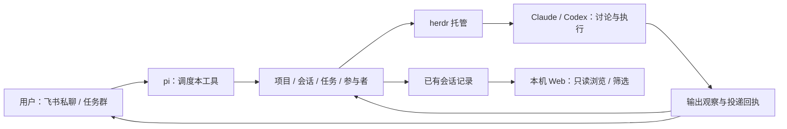

# 当前业务场景、命令取舍与遗漏检查

核对日期：2026-09-18。基线：`eb838d6` 及核对时的工作区。仓库已经是 Node + TypeScript + pi 实现，且有尚未提交的运行逻辑修改；本文是源码盘点，不代表这些修改已发布或通过现场验收。本文的初始盘点只更新文档；后续修复和真实验收以现场矩阵为准。

[原始重构需求](node-pi-refactor-requirements.md) 保留 Go `7b75511` 的历史场景与 D01–D16 问题；[实施设计](node-pi-design.md) 记录后来采用的默认方案。默认实现选择不等同于用户逐项确认。本文把当前业务与剩余取舍集中列出，便于继续讨论和调整。

2026-09-18 最新范围纠正：真实业务全部从飞书私聊或任务群发起，Web 仅只读查看会话记录。网页可本地浏览、筛选历史，不改 active pi session 或服务端业务身份，不发消息、不建任务/项目、不审批/清理、不修改配置，无命令入口。当前正在整改实现；旧 Web/API 业务证据保留，但不得算作飞书业务入口通过。

以下场景以纠正后的产品边界为准；原 Web 写功能属于已有实现偏差，不能因为曾有代码或通过测试而继续保留为需求。

## 1. 已明确的职责

**pi 负责当前工具的业务：管理项目、pi session、任务、参与者和消息调度。用户项目的需求讨论、方案、开发、测试与评审，交给 herdr 托管的 Claude／Codex。**

| 对象 | 本项目管理的内容 | 不能混同的内容 |
| --- | --- | --- |
| 项目 | 名称、目录、默认执行器；创建任务时冻结目录配置 | 删除项目登记不等于删除代码；新任务不等于新项目 |
| pi session | 调度上下文、历史、名称、切换、清空上下文、归档与恢复 | Claude／Codex 原生 session 的托管仍归 herdr |
| 任务 | 完整要求、类型、参与者、状态、结果、执行资源和平台关联 | 模型一轮回复结束不代表任务验收完成 |
| 参与者 | 独立 ID、名称、角色、herdr 资源引用、投递与输出记录 | 同为 Codex 的两个实例仍是不同参与者 |
| 入口与群 | 飞书私聊、任务群负责业务；本机 Web 只读历史 | 群、pi session、任务不是同一个对象 |
| 事实与回执 | SQLite 中的操作意图、资源绑定、消息送达及恢复记录 | 模型摘要不能代替事实，换 session 不清除防重放记录 |

一个入口 pi session 可以安排多个任务；每个任务有自己的调度会话。任务群固定绑定任务。群内由一个飞书机器人标注 Claude／Codex 的发言来源，当前并没有两个独立的飞书机器人账号。

依据：[业务类型](../src/core/types.ts)、[会话管理](../src/runtime/sessions.ts)、[工具入口](../src/app/tools.ts)。

## 2. 当前业务场景

“有实现”只表示已找到对应代码；完整通过条件还需按[现场验收矩阵](live-validation.md)验证。

| 场景 | 纠正后的业务要求（不代表已完成） | 必须保留或补验的边界 |
| --- | --- | --- |
| 安装、授权、启动 | setup 复用或注册应用并验证消息/卡片；serve 连接飞书并提供只读历史页；configure 保留为不连接飞书的记录页启动命令，仍有既有后台 tick | 共用状态锁；授权失败不自动更换应用；停止本工具不销毁 herdr 会话 |
| 登记或新建项目 | 登记多个目录，首目录为主目录；明确新建项目才创建目录 | 在途任务保留配置快照；共享目录有跨任务并发写入风险 |
| 查询和安排工作 | pi 查询项目、任务、参与者及状态，再调用相应调度工具 | 创建返回 queued 只代表本地登记；须核对资源引用、initialSent 才能报告群已创建、要求已转交 |
| 单参与者讨论 | discussion 可不绑定项目，使用独立讨论目录 | Claude／Codex 讨论业务；pi 只安排与传递；讨论只读约束目前依赖执行提示和执行器权限 |
| Claude 与 Codex 同群讨论 | 一个任务可有 1–8 位参与者；多参与者讨论默认轮流，4 轮、30 分钟，也可人工安排 | 发言标注来源；预算耗尽、暂停、阻塞时停止后续轮转；参与者发言不能变成新授权 |
| 讨论转开发、评审或测试 | 创建关联的新任务；parentContext 保存原任务要求、结果和参与者最近输出，本次 requirements 独立保存 | 新任务不是对讨论全文的完整复制；谁确定交接结论、是否需要用户确认版本仍需产品约定 |
| 多 pi session | 主机器人私聊长上下文自动压缩；飞书主入口私聊的 exact /clear 不调用模型，事务归档旧 session 并新建选中，成功后仅回复 CLEAR_NEW_SESSION_OK，AI 关闭或模型不可用时也可用；旧历史/回执保留，旧队列不改绑且拒绝执行；Web 只读历史，不切换活跃会话或重置上下文 | 群聊不轮转；进入处理流程的群消息明确拒绝，非任务群无 @ 仍按路由忽略；不清任务或原生执行 session；飞书会话选择、刷新、重启和迟到回复分别验收，新机械轮转现场证据见矩阵 |
| 群内续聊与引用 | 绑定群路由到本任务；AI 路径从本 session 历史查找被引用消息作为参考 | 未找到引用不能声称已读；多个参与者必须明确接收者或采用已建立的调度规则 |
| 参与者管理与现场处理 | 添加、移除、定向发送、中断、查看屏幕、审批卡片 | 移除涉及受管 pane 关闭；同名目标需消歧；审批校验身份、状态及 nonce |
| 进度与结果 | 读取 transcript 和实际执行状态，保存输出并同步平台描述/通知 | 排队、送达、开始执行、执行结束和验收完成分别呈现；Web 读取不发送 ACK 或改写投递回执 |
| 完成、关闭、销毁和恢复 | 新任务 completed 确认后默认解散群，明确 keepGroup:true 保留；review 不触发；旧来源未知策略仅在完成/关闭/销毁时迁移为默认解散，历史显式保留回执优先 | 完成默认通过herdr关闭执行器，任意群解散均清对应资源；保留执行器须明确keepExecution:true，有群时同时keepGroup:true。代码/worktree保留，收尾异步；收尾通知生成失败记 unavailable 后继续授权清理，未知发送及最后结果投递仍拦截清理 |
| 模型不可用时操作 | CLI 诊断、飞书机械 /clear 不依赖模型答复；关闭 AI 后有飞书兼容命令；Web 仅查看历史 | AI 请求失败不自动走无 AI 命令或向终端投递原文；故障状态须可定位 |
| 重启、迁移与升级 | 保存业务事实、操作和投递回执；旧 Go JSON 备份后导入 SQLite | 未知结果不自动重做；回退需对账真实外部资源，没有自动反向迁移 |
| 分发和本机历史查看 | Node SEA 包含运行时、服务、前端及原生扩展；系统浏览器访问 loopback | herdr、已认证的 Claude/Codex 和 Git 仍是外部依赖；逐平台独立验收 |

依据：[消息路由](../src/app/messages.ts)、[任务创建](../src/tasks/create.ts)、[资源建立](../src/tasks/provision.ts)、[输出观察](../src/tasks/observe.ts)、[飞书及 pi 操作实现](../src/app/actions.ts)。

### 生命周期用语

| 操作 | 业务含义 |
| --- | --- |
| pause | 停止后续自动调度，不等于杀掉正在运行的执行器 |
| interrupt | 中断指定参与者，并暂停自动讨论；不同于任务完成 |
| complete | 登记完成并同步平台，默认通过herdr关闭执行器并解散群；明确keepGroup:true只保留群，keepExecution:true有群时须同时保留群 |
| close | 完成确认后收尾受管执行资源，群按保留策略处理 |
| destroy | 清理受管资源，不自动宣称业务验收通过 |
| reopen | 恢复仍保留执行资源的已完成任务；异步同步结束前不能假设已可继续投递 |
| retry | 对允许恢复的失败步骤继续处理，不是重新执行结果未知的操作 |
| session archive / clear | 仅归档或重置 pi 调度上下文，不代替上述任务操作 |

依据：[生命周期](../src/tasks/lifecycle.ts)、[会话管理](../src/runtime/sessions.ts)。

## 3. 命令精简结果与建议

没有使用频率数据，不能把“较旧”直接判为“无用”。当前顶层 CLI 已经完成一轮精简；以下剩余建议尚未执行。

| 类别 | 当前有效入口 | 取舍建议 |
| --- | --- | --- |
| 日常 CLI | serve、setup、configure、doctor、version、help | configure 启动本机记录页且不连接飞书，HTTP 无业务/配置写入；其启动仍有迁移与既有后台 tick，不能把 CLI 整体视为无副作用 |
| 维护 CLI | migrate；debug ls / screen / transcript | 保留但不要求普通用户记忆；debug transcript 返回记录数据，不再只是旧版路径语义 |
| 已退出的顶层 CLI | ls、dialog、tail、key、say、transcript、watch | 不恢复旧语法；只读能力归入 debug，输入/审批归入参与者上下文 |
| AI 开启后的聊天 | 除 exact /clear 会话命令外，文字及斜杠文本交由 pi 理解 | /clear 的确定性例外不扩展为普通业务关键词路由；飞书卡片操作仍由程序执行，Web 无业务控件 |
| AI 关闭后的任务命令 | /new、/tasks、/projects、/task、/screen、/stop、/sessions、/session，以及 /help、/doctor | 如保留无 AI 使用场景，保留必要人工入口；/new 当前创建开发任务，不能改称新建 pi session |
| 旧桥专用命令 | /ls、/card、/say、/stop、/mirror、/close | 只有取消“接管已存在 agent”场景后，才一起移除旧桥及其选择、引用、镜像逻辑 |
| 关闭项目的别名和固定短句 | /关闭项目、/关闭本项目、/确认关闭等；非 slash 确认关闭、新建任务句式 | 优先退出候选，统一为明确任务操作，避免混淆项目、任务和群；需同步处理兼容说明 |
| /clear | 仅实际正文 `text.trim() === '/clear'` 时直接执行，不调用模型，AI 关闭也可用；飞书主入口私聊事务归档旧 session、新建选中，成功后仅回复 CLEAR_NEW_SESSION_OK | 引用内容不触发；群聊确定性简短拒绝；失败不送成功，旧历史/回执保留，旧队列仍绑定旧 session 并因归档拒绝；不清任务/herdr；Web 无命令或清空入口 |

旧桥 `/close` 只解除选择；任务 `close` 会触发收尾，两者绝不能合并映射。命令删减应逐项核对“保留能力、替代入口、旧调用的明确报错”，不能把未知命令透传给执行器。

依据：[CLI 参数和帮助](../src/cli/args.ts)、[诊断入口](../src/cli/diagnostics.ts)、[聊天兼容入口](../src/app/messages.ts)、[旧桥](../src/app/legacy.ts)。

## 4. 遗漏、差异与待收口事项

| 优先级 | 检查项 | 当前结论及下一步验收标准 |
| --- | --- | --- |
| 高 | pi 职责与真实动作 | 工具边界已存在，但模型说“已创建/已转交”必须有真实操作和资源/投递回执；不能只检查提示词或成功回复 |
| 高 | 连续创建与多 session | 用户已明确后续不同项目不能被前任务运行或 blocked 拖住；验证三个真实项目和多 pi session 的登记、资源创建、执行器启动相互独立 |
| 高 | 会话归档历史 | 首次归档历史为空的旧失败保留；E15 真实 Chromium 已确认机械 clear 后归档历史可见，其他切页/恢复组合仍逐项验收 |
| 高 | 历史浏览不改变业务选择 | 撤销 Web restore/select 等写入口；本地切换查看、刷新及重连不能改变飞书 active session 或调用模型。旧选中丢失及修复记录只作历史 |
| 高 | 讨论转执行的交接物 | 现有快照主要是要求、结果与最近输出；需明确结论版本、原讨论链接和用户当前要求，避免把最后一句等同完整共识 |
| 高 | 共享目录与只读讨论 | worktree 只隔离首目录；其他目录和 shared 任务仍可能互相影响。讨论提示不是文件系统只读保障，不能承诺硬隔离 |
| 高 | 启动阻塞与信任确认 | 用户已明确：保留 Bypass；仍出现的目录信任由 pi 识别并通过受限工具自动确认，其他选项发到群里由用户选择。需验收新目录、重复确认、目标变化及初始要求仅投递一次 |
| 高 | 关闭、重开及未知结果 | 平台同步、最终输出保存、资源关闭和群保留分别核对；失败或重启后不得重复创建、发送或清理错误资源 |
| 中 | 本机历史范围 | 可按已允许身份筛选记录，筛选仅是本地视图；不得通过 identity.select 写业务身份，不显示未允许身份或敏感配置 |
| 中 | 产品模式范围 | 是否继续支持无 AI 任务与旧桥仍决定下一轮命令删减幅度；当前实现保留不代表必须长期保留 |
| 中 | 群中发言、引用和迟到回复 | 明确轮数定义、定向/广播、参与者退出后的输出、暂停后输出保存。回复来源与新用户授权分别记录 |
| 中 | 历史查看与活跃会话 | 业务会话选择只由飞书控制；Web 查看不同记录不要求也不允许同步 active session |
| 中 | 模型故障与硬上限 | 明确可见故障状态；4 轮/30 分钟与 pi 工具次数限制不等于总费用或全局活跃 agent 上限 |
| 中 | 数据保留、迁移及交付 | 历史/回执暂无自动过期清理；需容量、备份恢复、旧任务对账及三平台空目录运行证据 |
| 范围外待提出 | 多模态、远程 Web、多机、多人业务协作、独立机器人账号 | 当前文字能力、loopback 和单机 herdr 不提供这些产品能力，不列为已经实现 |

优先确认的产品选择是：是否保留旧桥/无 AI 模式、讨论成果如何确认与交接、只读历史的展示范围、共享目录是否满足预期。这些会影响命令、数据关系和界面语义，其余实现细节可按选定方案推进。

## 5. 验收与文档使用

最小业务闭环全部从真实飞书用户交互发起：创建讨论任务 → 两位参与者有来源标记地交流 → 用户暂停/继续 → 指定参与者产出结论 → 明确授权后创建关联开发任务 → 查询真实进度及处理审批 → 完成/关闭 → 切换或恢复 pi session 后仍能核对历史与任务。过程中独立验证“群保留”“不影响其他任务”“重启不重复副作用”。Web/API 直接操作只保留底层或历史证据；Web 另验浏览记录、不写状态及旧写请求拒绝。

本轮证据仅包含源码、命令表与文档交叉核对，CLI help 和参数解析检查，以及 Markdown 相对文件链接和差异检查；没有运行模型、飞书、herdr、浏览器、构建或全量测试。不把旧验收记录计为本轮通过。

- 历史业务完整列表： [原始需求盘点 B01–B18 / N01–N07](node-pi-refactor-requirements.md)。
- 当前实施选择与存储/打包路线：[Node + pi 设计](node-pi-design.md)。
- 已有离线证据：[验收映射](acceptance.md)。
- 实际外部链路、失败和待补证据：[现场验收矩阵](live-validation.md)，其未完成项不能由本次文档盘点关闭。
