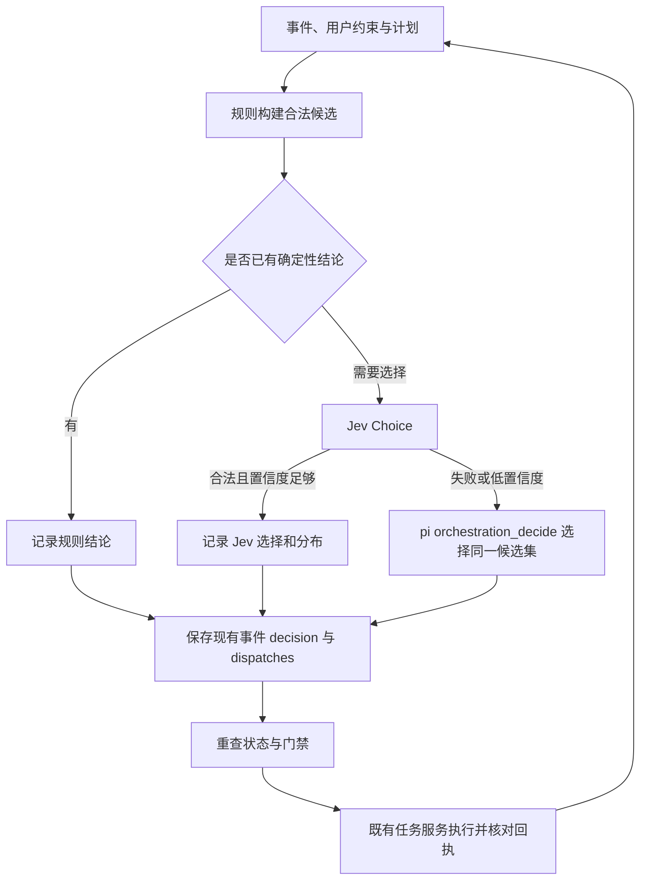

# myrix：Jev 与 LLM 协作的多 Agent 编排设计

日期：2026-09-27
版本：v1.1（源码对照修订版；已完成本地实现，未发布）
源码核对基线：`d2a0ba0c3e1c302dbb809e66db18a87b6e2974cb`
来源：2026-09-26 的 `myrix-jev-llm-orchestration-design.md` v1.0，以及后续源码对照修订意见。

本文替代 v1.0 中冲突的设计选择。用户已明确接受 B1/B2 边界变更；S3/S4 的实现随本 PR 提交评审，尚未发布或重启生产服务。实现映射、验证证据和现场验收缺口见[本地交付与复核记录](workflow-implementation-2026-09-27.md)。[持续调度审计](ai-orchestration-audit-2026-09-25.md)保留当时事实，不追写为本版验收证据。

实施顺序为 [S3：工作流编排](specifications/S3-workflow-orchestration.md) → [S4：入口路由与验证](specifications/S4-ingress-verification.md)，两份 spec 一起发版，不设独立影子阶段。两项边界变更的确认方案单列在 S4 第 1 节。

仓库根 `specs/` 被现有 `.gitignore` 作为含本机私有值的历史材料排除，因此本版新 spec 放在 `docs/specifications/`，不改变历史目录的忽略规则。

## 1. 目标与本次修订

LLM 理解需求、生成和修订计划；Jev 在运行时提供的合法候选中选择；myrix 校验并执行、保存回执和事实；Claude/Codex 完成讨论、设计、开发、验证、评审和报告。评价目标是任务能否推进并交付，而非发言数或调用数。

| 议题 | v1.1 决定 | 源码依据 |
| --- | --- | --- |
| 轮数与预算 | 不恢复任何固定轮数、决策数或累计时长上限；非空 open 集合连续 N 个有效轮次不变时请求用户裁决，不强制综合或完成 | `src/core/types.ts` 的 `DiscussionPolicy`、`OrchestrationPolicy`；持续调度审计 |
| 私聊入口 | 单独开关、默认关闭；Jev 只选 intent 和 project，高置信度走确定性建任务，低置信度交给 pi | `src/app/messages.ts`、`deploy/config.example.toml` |
| 验证执行 | 仅执行项目显式配置的 verify 命令；未配置则委派独立评审 agent 复核，报告标明证据来源 | `src/runtime/types.ts` 无 coding/shell 工具 |
| 共享看板 | 放在 `stateDir/tasks/<id>/board/`，通过附加目录挂载，不创建仓库 `.myrix/`，不改 `.git/info/exclude` | `src/herdr/lifecycle.ts` 的 `startupArgs()` |
| 状态身份 | 在现有 `revision()` hash 中加入计划版本和阶段，继续用 superseded 失效机制 | `src/app/task-orchestrator.ts` |
| 并行门禁 | `processTask()` 只等待本阶段已派发的参与者结束；在该调度入口按 realpath 做跨任务目录冲突检查，不引入租约 | 同文件；`src/tasks/send.ts` 保留非讨论任务串行 |
| prompt 兼容 | 状态块使用新模板版本；精确保留旧模板供 `participantPromptCandidates()` 回读核验 | `src/tasks/prompts.ts` |
| 唯一执行链 | 决策进入现有 `OrchestrationEvent.decision`、`dispatches`，复用 `tasks().send` 与 `reconcileDispatches()` | `src/app/task-orchestrator.ts` |
| 交付 | workflow 的 `notify()` 组装 `report.md` 和摘要卡片，deliver 依据报告合同，不再只依据单个 outputId | 同文件 `decisionTool()`、`notify()` |
| 代码组织 | 新逻辑进入 `src/orchestration/`，原 orchestrator 保留调度与恢复衔接 | 基线文件 845 行，本地实现后 920 行；`scripts/check-lines.mjs` 限制每文件 1000 行 |

原稿中的独立递增 `stateRevision`、`dispatch_intents`、`workspace_leases`、fencing token 和 A/B/C 影子上线步骤退出本版方案。

## 2. 模式与职责

新增每任务 `orchestration.mode: "workflow"`。在任务与 AI 功能已启用、Jev key 已配置且用户未显式选其他模式时，新任务默认保存 workflow；未配置 key 时沿用现有默认。任务创建时冻结模式，后续配置变化不批量转换任务。

历史 `model`、`manual` 和依赖 `discussion.mode: "round_robin"` 的任务保持原行为，包括旧通知及交付证据路径。显式策略优先于新默认。不得把读取旧记录时缺失的字段补成 workflow。

| 组件 | 职责 | 不拥有的权限 |
| --- | --- | --- |
| LLM Planner | 生成三类流程计划、任务书、交付要求，按新事实重规划 | 不能注册任意工具、命令或扩大授权 |
| Jev | 选择合法候选；按需提供单项语义判断 | 不抽取自由文本字段、不撰写报告、不执行动作 |
| pi 后备选择器 | Jev 失败或低置信度时，用 `orchestration_decide` 从同一候选集选择 | 不通过额外业务工具另发安排 |
| myrix | 构建事实、校验候选、持久化、调用既有执行服务、恢复回执 | 不把模型意见变成用户授权或已验证事实 |
| Claude / Codex | 接受明确任务书，执行并提交结果、状态块和证据 | 不自行控制 myrix，不把其他 agent 发言当新授权 |

角色与品牌分开，Claude/Codex 都可以担任实现者或评审者。每个任务始终只有一个执行调度器；规则、Jev 和 pi 只是同一调度链的选择来源。

## 3. 工作流计划与三套模板

持久计划以 `id` 表示 workflow 身份，至少包含不可变 `version`、目标及用户约束引用、模板类型、阶段、节点及依赖、参与者绑定、议题、交付合同、重规划条件。节点必须写清目的、输入引用、执行角色、预期产物和完成证据。

三套模板为：

| 模板 | 默认流程 | 边界 |
| --- | --- | --- |
| discussion | 独立开场 → 交叉回应 → 补证据 → 整合与复核 → 报告 | 仅讨论，不修改项目；开发需按用户授权建立关联执行任务 |
| development | 核对需求 → 方案 → 实现 → 验证 → 独立评审 → 必要返工 → 报告 | 简单需求可缩短规划；正常阶段切换不重复请求已有授权 |
| bugfix | 复现或失败证据 → 定位 → 最小修复 → 针对性回归 → 相称评审 → 报告 | 难以定位或涉及重大取舍才升级讨论，不强制多轮开场 |

`bugfix` 是 workflow 模板类型，首版映射现有 `TaskKind.development`；不为模板增加一套任务生命周期。业务阶段可用 `clarifying / discussing / planning / implementing / validating / reviewing / reporting / awaiting_acceptance`，与现有 `TaskStatus` 分开保存。

任务显式保存 `orchestration.template` 时，Planner 的候选枚举、工具执行及计划校验均保留该模板。重规划可以调整同模板下的节点，不能静默改换模板；未显式指定时才由 Planner 在任务类型允许的模板中选择。

程序校验节点引用、依赖可达性、动作注册、输入证据、交付或阻塞出口及授权范围。返工以明确状态转移表达，普通依赖不形成环。首次由受限 Planner 选择并细化模板，复杂任务或重规划可提交经过校验的自定义节点图；不在每次发言后重做整张计划。当前模板将需求核对与方案合并为 analysis；小 Bug 将针对性验证与独立评审合并为 validate，默认只有 analysis → implement → validate → report 四个节点。复杂化阻塞可选择 replan，增加讨论或补证据节点。

## 4. 状态、revision 与僵局检测

计划版本保存在 `workflow_plans`，当前状态保存在 `task_workflows`。自定义图拒绝循环、漏依赖、提前报告、越权写入，以及在实现之前验证/评审。`requiredArtifacts` 明确需要交付的文件；运行时核对声明、版本、真实路径及文件 hash。

### 4.1 事实来源

运行事实来自回执、现场或记录；模型判断保存模型版本、标准和输入；用户授权来自认证入口及既有配置。三者不能互相替代。参与者“测试通过”的自然语言先记为自述。

决策快照只包含目标、硬约束、计划版本、当前阶段、议题及证据摘录、参与者可用性、未结束委派、产物与验证状态、合法候选。原始材料保留引用，不向 Jev 默认发送整个仓库或全部会话。

### 4.2 复用已有 revision

现有 `revision()` 已 hash requirements、用户消息、resume 和 mutation。workflow 在同一 hash 输入中追加计划版本及阶段；没有 workflow 的任务保留旧算法。继续复用事件的 `userRevision` 和 `superseded`，不另建递增版本计数器。

输出事件仍携带 `outputIds`；候选及其输入快照绑定到该事件和 revision。执行前重查 revision、前台用户消息、暂停/取消及当前合法性，防止相同计划阶段内现场变化使旧候选误执行。计划版本用于任务书内容版本，revision 用于判断决策是否过期，二者职责不同。

### 4.3 open 集合僵局

每个问题有稳定 issueId、来源、证据、负责人、回应和状态。open 集合是当前尚未解决的问题 ID 的排序去重集合，改写描述或重复发送不产生新问题 ID。

一个有效轮次指本阶段本批已派发委派均取得对应的已结束输出，且状态块完成归并；轮询、重试、启动输出、迟到旧输出和重复事件不计轮次。持久保存上次 open 集合、连续不变计数及已计入的批次身份，重启不重计。

非空 open 集合连续 N 个有效轮次不变时，进入等待用户裁决，列出未决问题、已尝试的方法和需要裁决的选项。N 是僵局检测窗口，实现时作为有校验的策略参数记录，不复用 `maxRounds` 或 `maxDecisions`。不因达到 N 自动综合、deliver、验收或清理资源。

集合变化或用户补充形成新 revision 后重新建立基线；模型仅为清零计数而换计划号不算用户裁决。空集合仍需检查报告合同，不能直接判任务完成；外部审批、未知投递等等待沿用已有恢复机制。

## 5. Jev、规则与 pi 后备

程序决定身份、权限、目录冲突、依赖、重复派发和报告完整性等机械条件；模型只处理语义选择。`Choice` 是首版主原语；确需判断回应相关性时使用 `Noul`，多维评价需要实测后再引入 `Score`。Jev 的概率分布集中程度不等于决策正确率。

候选绑定动作、节点、参与者及输入版本，例如“codex-2 检查 design-v2 的迁移兼容性”。首版动作覆盖节点派发、补证据、请求重规划、请求用户裁决、准备报告、等待及合同满足后的交付。建群和参与者管理继续走既有受限任务服务，不向选择器开放无范围的资源工具。

每次决策按以下顺序执行：

1. 归并有效事件，读取计划、事实及回执，构造合法候选与快照。
2. 记录规则结论；规则已确定的等待或恢复动作直接采用，Jev 记为 skipped 及原因。
3. 需选择时调用 Jev，保存完整候选分布、模型版本、输入引用、超时或解析错误、置信门槛及策略版本。
4. Jev 超时、错误、无效候选或低置信度时，本步回退 pi；只提供从同一组候选选择的 `orchestration_decide`，不提供直接投递等写工具。
5. pi 同样接受候选、revision 和运行时校验。后备失败则保存原因并等待恢复或用户处理，不无限互相重试。
6. 最终选择来源记录为 rule、jev 或 pi；保存所选候选与后备原因，然后进入同一执行路径。

这是 workflow 内明确的后备策略，不改变任务 mode。Planner 与后备选择器是不同调用：前者输出计划和任务书，后者不能临时扩充候选或派发权限。

离线回放记录包含规则结论、Jev 分布、最终采用来源、候选和输入快照、计划/模板/模型版本及执行回执关联。回放不得触发业务写操作；没有调用 Jev 时不伪造分布，未执行候选的实际效果不能从日志推断。

## 6. 执行链、并行门禁与恢复

### 6.1 保留唯一派发路径

workflow 扩展现有 `OrchestrationEvent.decision` 的候选和报告引用，并以现有 `dispatches` 保存稳定 operationId、参与者与派发状态。调用 `tasks().send`，由原操作回执和 `reconcileDispatches()` 核对结果；不增加 `dispatch_intents` 表或第二套派发队列。

当前 model 模式是先由工具安排再 `orchestration_decide` 总结。workflow 的受限选择应先保存决策再执行；这需要按模式适配 `decisionTool()` 的 continue 校验，不能直接复用“continue 必须已有 sent”的前置条件，也不能改变旧 model 语义。continue 的派发完成事实仍以 sent 回执为准，保存选择本身不代表执行成功。

| 崩溃或竞态 | 恢复方式 |
| --- | --- |
| decision 已保存，尚无 dispatch | 重查 revision 与候选合法性，按原选择创建原派发，不重新选相反动作 |
| dispatch pending / uncertain | 核对原 operationId，不能换 ID 或参数盲目重发 |
| 原回执已成功，状态未更新 | 从原回执补齐状态，不重复外部效果 |
| 旧输出迟到 | 保存历史，核对委派及输入版本后才能推进节点 |
| 用户修订、暂停或取消时选择返回 | 失效旧选择，禁止新派发；核对已发生的副作用 |
| 服务重启 | 从事件、派发与操作回执恢复，重建阶段活动集合和目录占用事实 |

数据库与外部系统没有共同事务，不承诺天然 exactly-once。取消不等于已发生的文件修改自动回滚。

同一派发的每次尝试只计一次；明确未执行的暂时拒绝保留初次加两次重试，恢复后仍复用原 operationId。目录准入等待、前台消息暂缓与安全停止不消耗失败重试次数；每次重新选择保留独立不可变日志，已选结果恢复时仍复用。未知执行结果不自动重发。这是单操作故障恢复，不是任务轮数或决策预算。

### 6.2 按阶段等待

修改 `processTask()` 当前等待“全部未移除参与者已启动且 idle/done”的门禁。workflow 只等待本阶段实际派出的参与者完成，并核对对应输出、错误和待核验派发；尚未派出的参与者不阻止首次调度。

阶段活动集合在派发时持久记录，空集合允许选择开场节点。讨论模板可以先组成独立开场批次，再等待该批全部结束后交叉回应。局部阻塞可在有事实说明后由规划明确拆分阶段处理，不把 blocked 或输出缺失视为完成。

独立开场只用于讨论任务；开发任务的规划也不隐式转成多人并行执行。`src/tasks/send.ts` 对非讨论任务的串行约束保持原样，不为此放开。

### 6.3 跨任务目录冲突

在同一调度门禁按真实目录 `realpath` 比较跨任务的主目录、附加项目目录及父子包含关系。只读讨论可并行，冲突目录写入保持单写者；有写副作用的测试视作写入。不能只比较路径字符串或仓库名字。

检查与派发登记必须在服务内统一串行临界区衔接，避免两个任务同时检查为空后各自派发。未确认停止的旧写者、未知执行结果继续阻止冲突写入；重启先恢复现场与回执。无需租约、过期抢占或 fencing token。

这只是 workflow 调度协调，不是文件系统隔离；手动启动的外部进程不受其强制约束。worktree 继续是显式目录模式，附加目录仍需核对。

## 7. 状态块、模板兼容与共享看板

### 7.1 版本化状态块

参与者自然语言结果后附新协议状态块，建议包含 `protocolVersion`、nodeId、委派引用、输入版本引用、summary、issues、artifactRefs、evidenceRefs、blockers。字段是内部协议，不是 Jev API 请求格式。

解析前先用现有输出采集证明其属于当前委派；解析后校验版本、引用存在性和任务归属。保留原文，缺失、截断或非法状态块不能被当作问题已解决或验证通过。可委派补全，但原生任务结果不得因解析失败丢失。

新增参与者初始 prompt 模板版本并冻结已投递文本/版本用于恢复。`participantPromptCandidates()` 保留当前模板及更早讨论模板的精确内容作为历史候选，不能直接覆盖旧 renderer 后声称兼容。旧候选仅用于回读，不能重新发为新指令；旧任务不会被强制要求补状态块。

用户指定的篇幅与对外格式优先。内部状态块由 myrix 解析与展示层分离，不为展示协议而增加用户未要求的正文。

### 7.2 看板位置与权限

看板位于 `stateDir/tasks/<id>/board/`，由 myrix 从持久事实生成，保存计划、阶段、问题、产物与证据索引，并承载最终 `report.md`。通过已有 `--add-dir` 机制挂给参与者，主 cwd 保持任务目录。新增挂载必须通过现有目录校验。

不在用户仓库创建 `.myrix/`，不改 ignore 或 `.git/info/exclude`。共享看板不成为所有任务共用的写目录；每任务独立。看板是可重建投影，不是第二套事实数据库；agent 对文件的更改不能直接产生状态转换或新授权。更新采用原子发布，参与者草稿和正式产物分开，避免覆盖。

附加目录可读写不代表只读沙箱，应通过角色任务书及运行时的引用校验维持事实边界。报告须保存不可变版本/哈希，不能只引用可被覆盖的当前文件。

## 8. 验证命令的明确边界（S4）

pi runtime 继续只注入业务工具，不提供 coding 或通用 shell 工具。新增的是独立、受项目配置约束的验证执行器，不接受 Planner、Jev 或 agent 任意生成的命令。

项目显式配置 `verify = ["npm run check"]` 才由 myrix 执行；未配置或空数组不执行，不自动从 package.json 猜命令。配置字段需纳入既有项目目录初始化和持久化路径，不能只改 TOML 示例却丢失 SQLite 项目设置。

执行要求：

- 将配置命令与配置版本绑定到任务验证记录，运行时只选择这些命令；不拼接用户原文、文件名或模型输出。
- cwd 固定为该任务实际主目录，worktree 模式使用任务 worktree；设有限的单命令超时，取消和超时后核对进程是否已停止。
- 暂停或正常关闭导致的取消，只有确认未启动或整个进程组已退出后，恢复时才可重新选择同配置、同产物的命令。新运行引用已取消记录并保存独立输出；重放旧候选只返回旧记录。失败、超时或退出未知不因此获得自动重跑资格，取消记录也不冒充成功证据。
- 保存命令、cwd、开始/结束时间、stdout、stderr、退出码或退出信号、超时状态和被验证产物版本。日志写入任务状态目录。
- 运行期间遵循目录写冲突门禁；实现变化后受影响证据失效。退出码 0 只证明该配置检查通过，不证明全部需求正确。

固定 cwd 是执行位置限制，并非 OS 沙箱；配置命令本身具有本机进程权限，不应在文档声称无法访问目录外资源。

用户明确禁止运行测试或验证时，Planner 记录 `validation.mode = "not_run"`、用户原文引用及原因；运行时核对引用确实来自用户，关闭 myrix 验证候选，保留独立只读评审与 `not_run` 证据，报告明确写“未运行”。参与者意见不能免除验证；此约束不撤销用户已授权的实现工作。

无 verify 配置且用户没有禁止验证时，由非实现者的评审 agent 在其已有工具和授权内独立重跑相关检查，并返回实际命令与结果。报告标“agent 复核”，不标“myrix 已验证”或笼统“已验证”。不能运行时记录“未运行”及原因，不能将代码阅读冒充重跑。必须由 myrix 验证的交付合同仍缺证据时保持未满足，不为通过而降低要求。

## 9. 报告合同与交付通知

| 模板 | 报告必需内容 |
| --- | --- |
| discussion | 推荐方案及依据、已解决问题、保留分歧、未决事项、后续任务与验收条件 |
| development | 目标与范围、验收项覆盖、实现及代码/PR 引用、验证来源和结果、剩余问题与使用说明 |
| bugfix | 复现条件或已有失败证据、根因、修复范围、回归证据、剩余影响与未验证场景 |

报告由指定参与者撰写，myrix 校验并组装到看板 `report.md`，生成含结论、验收覆盖、验证标签、未决项和报告访问方式的摘要卡片。`notify()` 接入该组装结果，workflow 不再简单转发最后一个参与者原文；业务结论仍引用参与者产物，程序不编造总结。

workflow 的 deliver 要求报告合同满足：必需章节及产物存在，证据属于本任务且版本适用，必需验证符合合同来源要求，阻塞项已有处理结论。保存报告版本/哈希及引用，单个 outputId 仅作来源，不能单独证明可交付。讨论报告可保留已明确说明的分歧；触发僵局请求裁决仍是等待，不等同正常完成交付。

“可交付”和“已送达”分开：先校验合同，再按现有通知回执机制发送，确认报告正文/附件和摘要均按约定送达后才记录交付完成。本地路径不能充当飞书用户可访问链接；渠道不支持文件时通过现有长消息机制发送完整报告内容并保留稳定回执。

报告发送结果未知不换消息 ID 重发；正文成功、卡片失败时只恢复尚未送达部分。报告来源与分片/卡片回执绑定同一事件，旧通知恢复逻辑继续有效。阻塞报告可以送达，但不等于目标完成。

交付不等于用户验收，验收不等于远端同步、执行器关闭或群解散已经成功；沿用既有授权、保留设置和真实回执分别处理。

## 10. 私聊入口 intent routing（S4，默认关闭）

入口与任务内调度分别配置。配置 Jev key 使新任务默认 workflow，不会同时开启私聊路由；私聊入口开关默认 false。开启后，规则未处理的符合条件的普通私聊文本会提交第三方 Jev 分类，文档必须清楚说明这一数据流。

入口顺序为“规则 → Jev → LLM”：身份/作用域校验、去重、exact `/clear` 等确定性协议优先；开启入口分类时 Jev 选择 intent 和 project；关闭、失败、低置信度或参数不足时由原 pi 处理。规则不是用关键词猜测普通业务请求的替代模型。

Jev 只能回答两个选择题：

1. intent：选择允许的建任务意图或交回 pi；候选包括无法确定/非建任务，不能强迫创建。
2. project：从当前用户允许的已登记项目中选择，必要时选择无项目讨论或不确定；不能生成路径或新项目名。

两个选择都适用且达到门槛，且其他必需字段能由既有项目/模板默认确定时，运行时用用户原文作为 requirements，以原文的确定性截断生成 title（沿用现有 80 字符展示策略），调用现有 `tasks.create`。完整原文及 `UserRequestSource` 保留，截断不能丢失硬约束的权威来源。

`messages.ts` 的“新建任务”处理是非 AI 分支先例，只说明确定性创建可复用，并不代表当前 AI 分支已允许 Jev 路由。复杂参与者安排、引用上下文、需要新项目或无法确定参数的请求交给 pi，不能让 Jev 自由抽取字段或忽略用户要求后默认创建。

分类前后继续保留原入站消息身份、会话与幂等来源；重试复用第一次已保存的路由决定和创建参数，避免同一消息变成两个任务。分类日志记录选择来源和必要输入，不记录 API key；不默默附带完整历史、仓库或附件内容。

S4 同步改写 README 中英文、配置示例及现行设计文档的原则为上述分层路由，同时明确默认关闭与原 pi 行为。主入口路由的 pi 是原对话与业务工具路径；任务内 Jev 失败的 pi 则是只选候选的受限路径，二者不能混用。

## 11. 代码组织与实施顺序

| 模块 | 建议位置 | 职责 |
| --- | --- | --- |
| 计划与三套模板 | `src/orchestration/workflow.ts`、`templates.ts` | 计划校验、阶段与交付合同 |
| 状态、状态块与看板 | `src/orchestration/state.ts`、`status-block.ts`、`board.ts` | 事实快照、问题、投影、僵局检测 |
| 候选与选择 | `src/orchestration/candidates.ts`、`policy.ts`、`jev.ts` | 规则、Jev、受限 pi 后备、可回放日志 |
| 目录门禁 | `src/orchestration/workspace.ts` | realpath 冲突判断，接入 processTask |
| 报告 | `src/orchestration/report.ts` | 合同、组装、摘要与通知证据 |
| 验证与入口 | `src/orchestration/verify.ts`、`ingress.ts` | 显式命令执行器、intent/project 分类 |
| 调度壳 | 现有 `src/app/task-orchestrator.ts` | 模式分流、事件、派发及恢复衔接 |

这些是建议落点，不要求每个职责都变成一张新表。新增 workflow/议题/证据等状态按现有 Store 风格扩展，派发和操作回执必须复用。

S3 交付状态层、三套模板、状态块及历史兼容、看板、报告合同、Jev 适配器与后备、决策日志，并完成对应门禁与恢复适配。S4 在其上交付入口路由、配置验证执行器和原则文档改写。两份 spec 顺序验收、同一版本发布；S3 不单独作为影子产品上线。

## 12. 验收与效果评估

S3/S4 的任务清单和验收表见对应 spec。公共完成条件如下：

- 三套模板可按实际结果推进，固定轮数和已废弃预算字段不截断任务；僵局只请求用户裁决。
- 新 workflow 与旧 model/manual/round_robin 分流明确，旧记录、旧 prompt 和旧通知可恢复。
- Jev 与 pi 使用同一候选、revision、权限和执行链；失败、低置信度和最终来源可回放。
- 独立开场、未派发参与者、同目录跨任务写冲突、迟到输出及取消竞态均有回归证据。
- 看板及日志写在状态目录，仓库不产生辅助目录或 ignore 修改。
- 报告合同、验证来源、送达回执和用户验收分别记录；无测试证据不能声称通过。
- 入口关闭时不向 Jev 发送私聊分类请求；开启后仍需真实用户原文、合法项目和完整必需参数。
- 按实现范围执行 `npm run check`、构建及项目要求的真实链路验收；当前文档更新不等于这些检查已完成。

不做独立影子阶段，但保留离线对照和真实任务评测。比较相同输入、候选、代码快照下 pi 与 Jev 的错误选择、无效讨论、过早交付、恢复正确性、成本和耗时；中文、否定约束、中途改需求和含糊短答必须覆盖。日志回放不能证明未执行动作的实际质量，fixture 不能替代真实 Jev、Claude/Codex 和飞书证据。

## 13. Jev 外部资料与待实测边界

本地适配器已按官方 API reference 核对 `POST /v1/systemone`、Bearer 认证、Choice 请求及分布响应，并固定默认模型 `jev-1.13.0`。真实合成中文请求已通过，见[Jev 证据](jev-choice-live-evidence-2026-09-27.md)。当前只实现 Choice，不假设已经验证 Noul/Score。真实模型、代理及平台链路的覆盖范围见[交付记录](workflow-implementation-2026-09-27.md)。

不假定 Jev 支持自由文本抽取、生成解释或报告；不将 confidence 当正确率。中文质量、长上下文、对抗性文本和阈值均需项目实测。精确计算、时间、路径、权限和外部执行事实始终由运行时判断。

- [Jev 与 coding agents 的分工](https://docs.typesafe.ai/introduction/coding-agents)
- [Choice、Score、Noul](https://docs.typesafe.ai/introduction)
- [模型与上下文](https://docs.typesafe.ai/models)
- [置信度](https://docs.typesafe.ai/confidence)
- [Score](https://docs.typesafe.ai/primitives/score)
- [Jev 1.13 已知限制](https://docs.typesafe.ai/model-jaggedness/jev-1.13)
- [结构化问题与分类树](https://docs.typesafe.ai/primitives/advanced)

源码核对入口：[调度器](../src/app/task-orchestrator.ts)、[核心类型](../src/core/types.ts)、[任务创建](../src/tasks/create.ts)、[消息入口](../src/app/messages.ts)、[投递](../src/tasks/send.ts)、[prompt](../src/tasks/prompts.ts)、[启动目录](../src/herdr/lifecycle.ts)、[runtime 工具边界](../src/runtime/types.ts)、[配置示例](../deploy/config.example.toml)。
