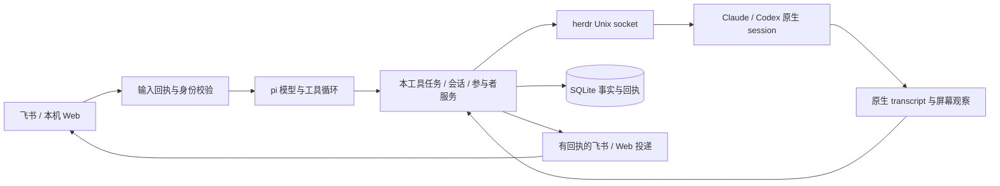

# Node + pi 实施设计

日期：2026-09-17。本文描述 Node 实现及采用的默认决策；[需求盘点](node-pi-refactor-requirements.md) 保留 Go `7b75511` 时点的讨论记录，不追写为“当时已确认”。实施进度以 [目标](refactor-goal.md) 和 [验收证据](acceptance.md) 为准。

## 核心职责

**pi 只负责 herdr-agent 本工具的业务。用户项目的需求讨论、方案、开发、测试和评审，由 herdr 托管的 Claude/Codex 参与者完成。Codex/Claude 原生 session 始终归 herdr。**

**启用 AI 后，pi 与用户如何沟通由模型决定。** 程序提供飞书、会话、项目、任务、参与者、消息投递和查询工具，执行身份、作用域、幂等和状态约束；不得用关键词、斜杠命令匹配、固定业务文案或失败兜底抢占模型决策。用户说“关闭”、贴出 `/new` 或问业务问题，都由模型结合上下文决定是否调用工具。程序不把模型故障降级为向终端转发用户原文。Web 显式按钮、真实审批按钮、CLI 诊断和关闭 AI 后的兼容命令仍走确定性操作。

业务事实和权限不存放在提示词里。模型不能指定 owner、替换任务群绑定、绕过人工审批、重发结果未知的写操作；参与者输出、引用和摘要是数据，不是新授权。通知由只读工具支持的模型决定是否发送及正文；参与者结果可以按真实来源直接展示，不能改称“pi 已验证”。



## D01–D16 默认决策

| 编号 | 本轮实施选择 | 约束与可观察结果 |
| --- | --- | --- |
| D01 | 入口 pi session 可安排多个任务；每个任务另有绑定的 pi 调度会话 | owner 隔离；入口可创建、命名、切换、归档和恢复；任务群不能切换别的任务。切换不重建编码 session |
| D02 | 一个飞书应用机器人代表本工具，正文标明参与者名称/类型 | Claude/Codex 不是独立飞书群成员；不声称支持独立机器人 @ 身份 |
| D03 | 明确目标的人工安排，或有界轮流讨论 | 多参与者讨论默认 round_robin，其他任务默认 manual；默认 4 轮、30 分钟。参与者输出仅触发已建立的调度规则；暂停、预算耗尽或目标不可用停止后续轮转 |
| D04 | discussion 可以不绑定项目，使用状态目录下的独立讨论目录 | 默认创建飞书 task 和群，可分别显式关闭；平台暂不可用保留远端意图并等待，不能静默降级为本地。仅本地任务需明确 `createGroup=false/createRemoteTask=false`。development/review/test 使用已登记项目 |
| D05 | 讨论转执行建立关联的新任务 | `parentTaskId` 关联原讨论，`parentContext` 冻结创建时的要求、结果和参与者反馈，`requirements` 保存本次用户要求。快照只作背景，本次要求优先；指定参与者形成业务结论，pi 只传递，不把讨论终结当作开发授权 |
| D06 | 默认 shared；显式可选 task 级 Git worktree | 同一执行任务内参与者串行投递；worktree 只隔离项目首目录，其余附加目录仍共享。跨任务 shared 可并行改同文件；关闭任务不删除代码/worktree |
| D07 | 新任务默认保留群；可配置 delete 或每任务覆盖 | complete 保留现场；close 确认完成后关闭受管执行资源；destroy 不自动验收。旧任务导入保留原先解散群语义 `keepGroup=false` |
| D08 | 保留关闭 AI 的任务操作及关闭 tasks 的旧桥模式；Web 同时管理会话、任务和项目 | 日常 CLI 精简，pane 写入入口退出；配置与显式人工操作不依赖模型答复 |
| D09 | Node >=24.13；TypeScript；`@earendil-works/pi-agent-core` / `pi-ai` 0.85.1 | 使用真实 pi 工具循环和两种模型 API 适配；业务 session、工具回执、投递回执由本项目持久化，不假设 SDK 自带群协作或事务 |
| D10 | Node SEA 可执行文件，嵌 Node 运行时、服务代码、Web HTML/CSS/JS 和 flock 原生扩展 | 目标 macOS arm64、Linux x64/arm64，各平台原生构建；系统浏览器打开本机页面。herdr、已认证 Claude/Codex、Git 仍是外部依赖 |
| D11 | OpenAI Responses / Anthropic Messages；自定义版本根 URL；file/HTTP 摘要存储 | 模型/记忆 key 来自 TOML；飞书凭据来自 env。`file` 兼容配置名对应新版 SQLite 本地存储。HTTP scope 使用 `chat_id=pi:<sessionId>` 隔离 pi session |
| D12 | Go JSON 校验后备份并事务导入 SQLite；不修改旧源文件 | 未完成任务保持资源绑定；旧可见历史和摘要导入，归档隔离；旧操作/事件/通知回执保留，不重新执行工具或广播旧结果 |
| D13 | 单任务 1–8 个参与者，允许同种模型多个实例、增员和退出 | 每位有独立 participant ID/资源引用；明确 ID 或唯一名称选择。退出关闭本任务受管 pane；跨任务复用原生实例不自动进行 |
| D14 | 文本与富文本中的文字、链接；文本结果与审批卡片 | 不提供图片理解、附件下载、语音转写、飞书文档写作或制品托管管线。富文本中的资源 key 不作为正文指令 |
| D15 | 单人单机、本地 herdr、loopback Web | 白名单和 owner 隔离是操作边界；Web 默认使用首个允许身份，可通过本机控件切换白名单身份并持久保存选择，不是多用户登录系统。国内飞书是当前接入范围；Lark 注册结果不会保存为可用配置 |
| D16 | 默认每批同时对账 4 个任务；讨论轮数/时间有上限，pi 单轮最多 12 次工具调用 | 这不是活跃 agent 总量或费用硬上限。暂停不杀进程；中断单独执行；完成或暂停仍观察迟到输出，不恢复轮转。任务 progress 通知按 notify_cooldown 合并最新状态；审批、最终结果、关闭前通知不受该冷却限制。历史/回执暂不自动过期清理 |

## 数据和恢复

`Session` 保存 owner、名称、代数、摘要与 task 关联；`Task` 保存完整要求、目录快照、生命周期、群与远程任务引用；`Participant` 保存独立角色、herdr workspace/pane/kind/session 引用、启动回执和 transcript cursor。任务主目录是快照，后来改项目配置不改正在运行的任务。

`state.sqlite` 中业务对象、消息、工具操作、输入/输出回执分别保存。写操作先记录意图，再调用外部系统，再保存结果。`not_executed` 可在明确重试操作后继续；pending/unknown 保留待核对状态，不把超时当作重试许可。任务生命周期与消息送达是不同记录。飞书任务描述按内容和回执对账，不因每次轮询更新时间不同而重复 PATCH；未知写入先查询确认。关闭前再次读取并保存尚未轮询到的最终 transcript，包括执行器已退出但原生记录仍可读的情况。

用户可见历史只接纳完整确认送达的答复。Web 先渲染，再提交 ACK；飞书分片逐条留回执。clear 增加 pi 会话代数并保留原文与回执，不清任务、不清 herdr session；旧代迟到结果不能回填新代。压缩只影响模型上下文，不删除原始消息。

默认文件：`config.toml`、`.env`、`state.sqlite` 及 WAL/SHM、`herdr-agent.pid`；运行日志由服务管理器收集。旧 JSON 仅是迁移源。`projects.json` 或 TOML 用作首次数据库 catalog 种子；已有 SQLite catalog 后，项目页修改写 SQLite。不要靠编辑旧 JSON 更新已运行的新 catalog。

### 迁移与回退

先停止旧进程及其 launchd/systemd 自动重启，保持同一飞书应用只有一个事件消费者。可先对显式状态目录运行：

```sh
herdr-agent migrate --state-dir /absolute/state --dry-run
herdr-agent migrate --state-dir /absolute/state
```

CLI 取得共享 POSIX flock；`serve`、`configure` 也在启动时执行同一幂等迁移。预览不导入或建立备份；CLI 仍需临时取得状态锁，已有数据库会以正常 SQLite 方式打开。应用备份写入 `backups/<timestamp>-<id>/`，包含原始文件和 hash/大小清单，目录 0700、文件 0600。备份后重新核对源快照，再在一个事务里保存导入和版本标记。

损坏的关键状态、重复对话作用域、已有同 ID 新记录、迁移后变化的旧业务源均拒绝覆盖。配置/凭据文件会备份，但不以明文内容存到迁移报告。旧 pending 外部操作冻结；旧 transcript 首次只取基线，之后才增量观察，避免广播历史结果。旧卡片 event/nonce 与旧消息回执继续拦截重放。迁移不从真实远端 memory 服务下载旧资料。

回退时停止新版，保留 SQLite、WAL/SHM 与备份，再核对 herdr 和飞书实际资源。新版新增任务、输入和清理不会回写 Go JSON，因此恢复旧快照前必须核对资源变化；没有自动反向迁移或“一键回滚”。不得仅删除 SQLite 后重启旧服务。

## 命令与模式

日常入口是 `serve / setup / configure / doctor / help / version`，另提供维护命令 `migrate` 和只读 `debug ls|screen|transcript`。旧本地 `key / say / watch / dialog / tail / ls / transcript` 不再作为顶层命令；终端输入与审批放在任务参与者和真实卡片上下文里。

AI 开启时，聊天文字及斜杠文本都交给 pi；快捷命令不优先于模型解释。关闭 AI 后，任务模式保留 `/new`、`/tasks`、`/projects`、`/task ...`、`/screen`、`/stop` 等兼容操作；旧 `/new` 仍创建任务。关闭 tasks 时保留旧桥 `/ls /card /say /stop /mirror /close`；此处 `/close` 只解除选择，绝不升级成销毁任务。具体 CLI 选项以 `help` 为准。

Web 提供 session/任务/参与者/项目界面、模型配置、授权状态、屏幕和审批操作。只监听明确的 loopback IP，校验 Host、Origin 和 CSRF；未开放远程登录。模型配置保存后需重启。`ui.max_cols/tail_lines` 只裁剪屏幕展示，不修改 Guard、阻塞检测或原始屏幕。停止 Web/服务不会自动销毁所有编码资源。

## 实现边界与待现场验证

职责划分有工具能力边界，但 Claude/Codex 讨论“只读、不改项目文件”的约束仍通过投递提示表达；Bypass 与 herdr 执行环境决定实际权限，不是本项目额外实现的文件系统沙箱。

独立二进制已经按实际平台做空目录烟测；不同平台、真实模型、飞书租户权限/群交互、真实 herdr 启动及审批仍按 [验收文档](acceptance.md) 分层报告。新增框架不消除 agent 检测、TUI 宽度、系统权限和供应商协议变化带来的现场差异。

## 分发归属材料

构建依据 esbuild 实际嵌入输入生成 `dist/LICENSES/`：包含 npm 依赖许可/NOTICE、fs-ext/nan 和当前 Node 安装的完整许可及第三方声明。发布 tar 包同时携带 LICENSES、本项目 LICENSE 和 README；程序运行不依赖旁边的声明文件，重新分发时应保留。缺失原文或固定来源校验失败会使构建失败。固定版本补充原文与来源见 [licenses](../licenses/README.md)，不以 esbuild 注释保留代替完整声明。
