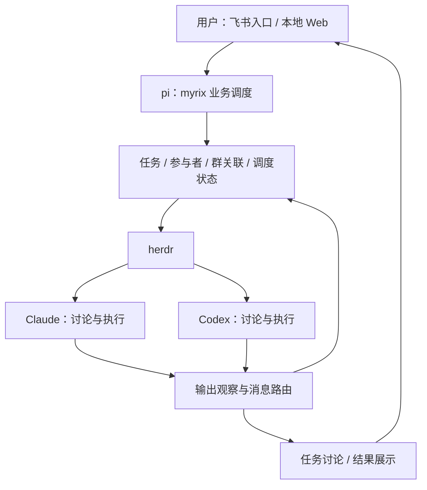

# Node + pi 重构：业务场景与需求清单

> 历史盘点快照：下文的“当前/尚未开始/待确认”均保留 7b75511 基线当时语义。后续实施见 [Node 设计](node-pi-design.md)、[验收映射](acceptance.md) 和 [执行目标](refactor-goal.md)，不以重写盘点代替决策记录。

更新日期：2026-09-18。现状核对基线：`7b75511`（仅作为 Go 时代历史快照）。状态：Node/pi 重构已合并并发布；本文件仍保留原始 B01–B18/N01–N07 需求语义，逐项真实验收以[现场矩阵](live-validation.md)为准。

本文整理程序实际承担的业务、已确认的新方向、命令精简建议和遗漏检查。标为“现状”的内容来自历史源码基线；标为“已确认”的内容来自需求沟通；其余为建议或待确认项，不代表已经实现或已经决定。当前实现、自动化结果和真实现场边界分别记录在[验收映射](acceptance.md)、[现场矩阵](live-validation.md)和[持续目标](refactor-goal.md)。

2026-09-18 范围修正：**真实业务全部从飞书私聊或任务群发起。** Web 可浏览、筛选会话记录，并维护本机项目（支持多目录，首目录保存时自动 Git 初始化）、默认项目、Bypass、模型连接和本机身份；不能发消息、创建任务、管理参与者、审批、清理资源或操作 pi session。旧 Web 业务管理与聊天设计退出范围；配置 action 受请求来源和 action 白名单保护。

下文 Go 基线的 Web 聊天和业务管理建议只作历史盘点；当前 Web 保留本机项目、模型和 Bypass 配置，B/N 业务能力仍由飞书交互承接。

2026-09-18 当前运行检查：仓库 `master`/`origin/master` 为 `f2afb9b`；运行中的 SEA 由旧提交 `e7e8b3e` 构建，本机运行 SEA 为 `0.3.6`，构建提交为 `e7e8b3e`，SHA256 为 `cee2c5cd1287be2b79cbb1b2ed4487025f47baaf974783c45cb6641b66df882d`，PID 为 `91732`；`/api/state` 报告 runtime 与 Feishu authorization 均为 `ready`。本地状态中的 23 个任务均为 `destroyed`，177/177 个 outbox 已送达；本轮回读的 28 个专用测试群均为 `dissolved`。这些是运行与清理事实，不关闭下文仍为 U、R-部分或 R-F 的业务场景，尤其是 LIVE-001 的真实用户入站重验。

## 1. 已确认的目标与职责

重构目标是使用 Node 技术栈和 pi 调度本工具，统一前后端语言，并整体打包为可执行文件。前后端统一使用 TypeScript 是实施建议；具体 pi 包、运行时版本和打包路线尚未核验。

**pi 只负责 myrix 自身的业务。用户项目的需求讨论、方案设计、开发、测试和评审交给 Claude／Codex，始终通过 herdr 托管。**

| 角色 | 负责的业务 | 边界 |
| --- | --- | --- |
| 用户 | 提出目标、参与讨论、选择或调整安排、确认结果 | 是否授权后续开发以实际指令为准 |
| pi | 本工具的项目、任务、参与者、群和 pi session 管理；组织讨论、分派工作、传递消息、查询进展 | 可以澄清“哪个项目、交给谁、建什么任务”等调度问题；项目本身的业务需求交给参与者讨论 |
| Claude／Codex | 讨论项目需求、提出方案、相互评审、编码与测试 | 可作为讨论任务的参与者；并非只有开始编码后才启动 |
| herdr | 托管 Claude／Codex 的执行环境及原生 session | 本项目通过已有接口调度、观察并关联它们，不另建一套编码 session 托管系统 |
| 本项目的确定性服务 | 身份与绑定校验、工具执行、状态持久化、事件去重、投递回执、恢复、飞书业务接入与 Web 配置/历史投影 | 这些事实和约束由程序维护，不能只依赖 pi 的对话记忆或提示词 |

已确认需要关注 **pi 的多 session 管理**，并支持创建讨论任务，让 Claude、Codex 参与，包含两者在同一群内讨论的场景。“同一群”内如何呈现参与者身份、何时发言，以及 session 与任务的对应关系，仍需明确。

2026-09-18 最新明确规范：飞书主入口私聊的 exact `/clear` 是确定性会话命令，不交给大模型，也不依赖模型额度。程序在事务内归档旧 pi session、创建并选中新 pi session，事务实际成功后只回复 `CLEAR_NEW_SESSION_OK`；失败或未完成不得送成功。该要求覆盖此前 `/clear` 必须由 pi 自主调用工具并生成文本的要求，普通业务沟通仍由 AI。所有群聊不支持，不清任务或 herdr 托管 session；旧历史和回执保留，旧排队消息不改绑且因归档拒绝执行。一般控制和通知简洁说明用户可见结果，内部诊断在用户追问时再给。旧模型驱动和 Web 轮转证据保留；E15 真实私聊机械轮转仍可作为该入口的证据。Web 无命令或清空入口，浏览历史不能改变活跃会话。

E18 已部署版本记录（不含本次只读 Web 整改）：运行源码 `0b6966ff6509d3e7cdc0a26e5ba660d7b4e14392`，PID38264，构建时间 `2026-09-18T03:49:25.716Z`，SEA SHA256 `feb114e3c0fd08752533b48c85d07ff7072081e3af9b7b3824f7ccac95680069`。format/check（345项测试）、SEA smoke及[同提交三平台CI 35304636486](https://github.com/hewenyu/herdr-agent/actions/runs/35304636486)通过；03:51回读飞书连接/授权ready，herdr PID39037保持。收尾阶段提示修正已部署，真实模型受控回执单样本通过，尚不称生产收尾回复重验；旧R-F保留。主入口无模型机械 `/clear` 语义不变。E17新增3任务及此前9任务均已确认资源清理，整体目标active。后续文档提交不冒充重新构建。

E17 部署与验收记录：`.cache/live/e17-deployment.json` 固定运行源码 `a6018ec1f51affce2b4160a0aea1a6e4483bcb1c`、PID `32000`、构建时间 `2026-09-18T03:24:39.516Z`、SEA SHA256 `87cfcebabb4957380713b7aa57440d3d79357727f1d8d33b0b06dfd2de168505`。format、check（345项测试）、SEA smoke 及[三平台 CI 35303089613](https://github.com/hewenyu/herdr-agent/actions/runs/35303089613)全部通过；飞书连接及授权 ready，herdr 原进程保留。

本次修复区分参与者显示名与合法原生名称，将 agent.start 的明确名称拒绝归为 not_executed；只有明确重名拒绝才换用稳定名称重试。迁移参与者独立 ID 的操作归属统一纳入 retry事务、pending恢复、错误保留；短可见文本的宽度改为 unknown。E17 的5d1e96f二进制 CLI 28项只读及迁移8项证据保留原版本：迁移4项为真实旧数据的 R-local-copy、4项为合成故障 O，不是生产迁移／完整回退。旧样本仅3个destroyed任务，无pending。

E17后续独立证据已确认B/C从真实飞书请求到原生执行、产物、署名群结果、远端描述与review等待验收的限定链路通过，见 `cli-e17-r2-completion.json`、`independent-e17-completion.json`。C入站和创建时A仍attention，B原生回合尚未结束；A的原生名称拒绝及误unknown历史R-F保留。03:03模型已恢复200/精确标记，不继续沿用旧额度阻塞。任务群owner无@ exact `/clear`拒绝也为限定R-P。

随后A/B/C均完成已授权资源清理，`e17-cleanup-readback.json`最终快照全true；B通过真实任务群无@完成指令调用task_action，回复送达和herdr close均早于删群。原9加本轮3共12群dissolved、panes缺失、pending outbox为0；inventory-e17两次remote GET400在03:45串行回读均200/completed，原失败保留且原因不确定，见 `test-resource-inventory-e17-read-errors.json`。

新增措辞R-F仍未关闭：B回复首句“已完成收尾”早于群解散，尽管正文说明尚未解散；实际最终清理成功不能覆盖该阶段事实错误。提示修正已在E18部署并通过345项check、真实受控回执probe单样本；尚未重验生产收尾答复，详见E18。a6018ec部署和345项测试/CI证据保留；整体目标active，详见[现场矩阵](live-validation.md)及[版本化证据 E17](live-evidence-2026-09-18.md)。

E16 历史进展：运行二进制已更新为源码提交 `5d1e96f1698af95ad0fa2317b34b73441518e968`，PID `26077`，构建时间 `2026-09-18T02:52:38.355Z`，SEA SHA256 `c165c6424037337cda912bc4471731fb7d0dfdc250c9e083148e8922b2c39ec5`。format、check（329项测试）、SEA smoke 和[同提交三平台 CI](https://github.com/hewenyu/herdr-agent/actions/runs/35301019616)全部通过；重启后飞书连接及授权 ready，herdr 原进程未重启。两专用群真实复现并验证删群回执丢失后的跨进程恢复，各仅一次 DELETE，最终均 dissolved；恢复只凭匹配群的 fresh GET 事实，保留原错误审计及其他未决问题。Web 身份隔离、17项 API 作用域检查、会话创建/重命名/归档/恢复和显式清空已补验，三个测试会话已归档并恢复原选择。memory 15项 loopback 协议检查仅为 O-P，外部服务仍未测。重启后原9个测试任务清理状态再次回读通过；原失败和未覆盖分支保留，整体目标 active。详细边界见[现场矩阵](live-validation.md)和[版本化证据 E16](live-evidence-2026-09-18.md)。

E15 历史部署与验收记录：`ab79cc0470f28c65473fc3810e6b8e39dc0a296f` 已按原部署运行，PID `20390`，构建时间 `2026-09-18T02:25:03.576Z`，SEA SHA256 `04d14c861c91c980038c9e659de68a86b531216c39f6c2b971444700adf20358`。`npm run format`、`npm run check`（315 项测试）及 SEA smoke 通过；[CI 35299218668](https://github.com/hewenyu/herdr-agent/actions/runs/35299218668) 已在同一源码提交的 linux_amd64、linux_arm64、darwin_arm64 三任务通过 check 与 SEA。E15 已独立回读真实私聊/Web机械轮转及本轮 9 个测试任务的资源清理；未测的整体功能项仍保留，目标 active。

修复同时覆盖 AI 关闭时旧归档 session 的排队命令拒绝，以及 Web 省略 sessionId 后用相同 requestId 重试造成重复轮转：按 owner/chat/messageId 加命令锁，命令回执与轮转同事务写入，重复请求复用原答复。`before_close` / `before_group_delete` 仅在通知生成失败、尚未发送时写入 `unavailable` 审计并继续已授权清理；不生成固定替代通知，不记录虚假送达。已尝试但结果未知的发送、未完成输入/输出和原生最后结果的投递屏障仍保留，不能借模型故障跳过。E15 真实私聊/Web机械命令及本轮 9 个已知任务资源清理已独立回读通过；通知 unavailable 如实未发送，旧失败保留，整体目标继续 active。

旧模型驱动方案 E14 现场状态（不代替新机械轮转验收）：`2aa5337` 真实 Web 已验证实际工具调用、归档切新、仅上述成功文本及可见 ACK；真实私聊两次 model_failed，未切换也未送成功，当时因上游 Kimi 五小时额度耗尽未能成功，恢复时间未知；该模型路径随后被机械命令取代，新路径通过见 E15。旧版私聊后续 canary 不属于该成功答复规范的证据，所有既有 R-F 保留。



这是目标职责图，不表示现有 Web 已有聊天能力，也不表示已验证 pi SDK 的全部能力。

## 2. 当前程序的业务范围

当前是 Go 服务、Eino 模型工具循环和内嵌 HTML/CSS/JavaScript 页面。程序同时保留了三种使用模式：

| 模式 | 当前用户体验 | 重构时的处理 |
| --- | --- | --- |
| 仅聊天桥 | 飞书选择一个已在 herdr 运行的 agent，发送文字、处理审批、查看输出 | 是否继续接管非本项目创建的 agent，待确认；不能默认所有旧命令都仍有价值 |
| 任务管理，无 AI | 用命令或有限固定句式创建飞书任务、任务群和一个编码 agent | 是否保留完整无 AI 模式待确认；故障诊断和必要人工操作不应依赖模型可用 |
| 任务管理，有 AI | 私聊助手创建任务、查询总览；群内助手处理当前任务的反馈、进度和结单 | 用 pi 重构该调度入口，并落实新的职责边界 |

当前 AI 依赖 `tasks.enabled = true`，不是独立产品模式。当前定位是一台机器上的个人工具；虽有白名单和按 owner 隔离，不应据此声称已实现多人协作产品。

**当前与目标的主要差异：**

- 现有入口助手参与需求沟通和澄清；目标要求项目需求讨论由 Claude／Codex 进行，pi 组织任务。
- 现有任务没有讨论/开发类型，也没有参与者集合；一个任务只绑定一种 agent、一个 pane、一个 workspace 和一个私有群。初始提示还要求在主目录完成开发并保存代码，因此讨论任务需要修改任务语义和提示，不能仅换一个任务标题。
- 现有会话以 owner + chat 定位一份活跃上下文并校验 task 绑定，不存在可由用户列出、命名和切换的 pi session 管理界面。
- 当前 Web 只有项目目录、默认 agent、Bypass 和飞书授权状态等配置能力，没有任务列表、聊天或参与者管理。
- 当前已经把前端静态资源嵌入 Go 二进制；重构需要延续独立分发能力，不是首次提供该能力。

依据：[AI 接入说明](feishu-ai-integration.md)、[任务记录](https://github.com/hewenyu/herdr-agent/blob/7b7551182bbc7ed962672720f54f7b06072888ee/internal/tasks/store.go)、[Web API](https://github.com/hewenyu/herdr-agent/blob/7b7551182bbc7ed962672720f54f7b06072888ee/internal/projectweb/server.go)、[启动组装](https://github.com/hewenyu/herdr-agent/blob/7b7551182bbc7ed962672720f54f7b06072888ee/cmd/herdr-agent/serve.go)。旧文档中“采用 Go、不依赖 pi/Node”的表述描述现有实现，不作为本次新方向的约束。

## 3. 需要区分的业务对象

| 对象 | 当前实现 | 目标与待定关系 |
| --- | --- | --- |
| 项目 | 名称、有序目录列表、默认 Codex/Claude；全局默认项目与 Bypass | 保留配置职责；讨论任务是否必须绑定已有项目待定 |
| pi session | 尚无；有现有助手的持久化会话 | 本项目管理其调度上下文、历史和恢复；创建、切换、归档的交互待定 |
| 任务 | 单个编码任务及生命周期、飞书 task、群、执行资源绑定 | 支持讨论任务与执行任务；是否还区分评审/测试，以及阶段转换方式待定 |
| 参与者 | `Record.Agent` 单值，只有 codex 或 claude | 同一任务可组织 Claude 与 Codex；参与者实例、角色、发言对象与输出来源需要显式记录 |
| herdr 资源引用 | workspace、pane、agent kind、原生 session 信息等 | 继续保存关联和核对依据；原生 session 托管仍归 herdr |
| 聊天入口 | 主应用私聊、绑定任务的私有群 | 是消息入口，不直接等同于 pi session；一个入口如何选择当前 session 待定 |
| 回执与状态 | 本地任务、工具操作、消息送达、通知决策等记录 | 必须独立于模型上下文保存；换 session、压缩、归档不能删除防重放事实 |

不能提前锁死“一个 pi session = 一个任务 = 一个群”。现有实现的单任务群关联也不应直接推导为新产品的唯一组织方式。

## 4. 当前必须盘清的业务场景

下表描述现状。重构可以改变交互和内部实现，但需要明确哪些能力继续保留、哪些经过确认后退出。

| 编号 | 场景与触发 | 当前行为和容易遗漏的边界 |
| --- | --- | --- |
| B01 | 首次安装与授权 | `setup` 新建或复用飞书应用，保存凭据、白名单；真实消息和按钮两次往返才算完整验证。已有凭据重跑以核验为主；重新注册是显式操作 |
| B02 | 启动与补授权 | `serve` 先取得单实例锁，再检查凭据/权限；本地页面在等待授权时可访问。同一 App ID 补授权后继续，不另开一条飞书连接；herdr 不可用或协议不兼容时不进入正常桥接 |
| B03 | 本机环境诊断 | `doctor` 检查 herdr 协议、继承环境、Claude/Codex hook、pane 宽度和相关配置；区分 PASS/WARN/UNKNOWN/FAIL |
| B04 | 登记已有项目 | Web 配置页管理一个项目的多个目录，第一个是工作目录，其余传为附加目录；默认 agent 和默认项目可配置。目录配置变更不改写已创建任务的快照 |
| B05 | 明确新建项目 | 在本机 `~/herder-agent-code/<项目名>/` 建目录并登记；主目录初始化 Git，不自动提交或创建 worktree。删除项目配置保留目录；普通“新建任务”不等于新建项目 |
| B06 | 创建任务 | 登记本地任务意图，逐步建立飞书 task、私有群、herdr workspace/pane，按项目配置启动一个 agent；建群邀请任务 owner。登记成功不等于 agent 已启动或要求已送达 |
| B07 | 初次启动确认 | 确认启动参数、多目录与 agent 身份后才投递初始要求；Bypass 默认开启，但新目录仍可能要求信任确认。无可用按钮时需在本机处理 |
| B08 | 群内续聊 | 对应 owner 在绑定群内直接发言，无需 @；AI 模式由当前任务助手路由，无 AI 模式按任务输入路径处理。群不能切换到其他任务或创建新项目 |
| B09 | 多任务与总览 | 可先后创建多个独立任务；默认总览隐藏已完成/已销毁记录，历史查询显式包含它们。群内查询限于当前任务 |
| B10 | 进度与产出 | 轮询/事件读取实际状态，观察原生 transcript，保存最近回复，同步飞书任务描述并向任务群发送结果。agent 一轮结束是待验收/等待下一步，不是任务完成 |
| B11 | 审批、屏幕与中断 | 阻塞卡片呈现实际问题和可选按钮；人工审批经完整 Guard 校验。普通文字不能作为菜单批准；中断、查看屏幕和回答菜单是不同动作 |
| B12 | 完成但保留现场 | `complete` 登记飞书任务完成，保留 agent 和群；完成同步是异步过程。后续需 `reopen` 才能继续投递要求 |
| B13 | 验收并关闭 | `close` 串联飞书完成确认、结果保存、关闭前通知处理，再清理受管 pane 和群。新观察到用户在飞书任务面板勾选完成，也会触发收尾 |
| B14 | 销毁与重开 | `destroy` 清理执行资源和群，但不自动完成飞书任务；代码和任务结果保留。已销毁会话不能重开；群删除后聊天记录不保留 |
| B15 | 失败与恢复 | 明确失败、临时查询故障、已发送未确认、外部操作结果未知分别处理；未知结果不自动重试创建/投递。重启从持久绑定核对现有资源，不重新执行所有步骤 |
| B16 | 助手会话与记忆 | 自动压缩与原文保留；飞书主入口私聊的 exact `/clear` 确定性归档旧 pi、创建并选中新 pi，事务成功后仅回复 `CLEAR_NEW_SESSION_OK`，不调用模型，失败不送成功；旧历史/回执保留，旧队列不改绑且拒绝执行。不清任务或herdr编码session；群聊拒绝 |
| B17 | 接管已有 agent | 非任务桥模式可通过回复绑定、选中对象或选择卡路由至已有 pane；会再次核对身份。开启任务模式后，无关本地 agent 不向入口私聊主动推送 |
| B18 | 长期运行与升级 | 前台服务由 launchd/systemd 管理；配置、凭据、任务与对话存本机。停止桥不等于关闭所有 herdr agent；升级不能丢失绑定或使事件重放 |

### 4.1 任务状态不能合并成“运行/结束”

当前状态为 `queued`、`starting`、`running`、`blocked`、`review`、`attention`、`completed`、`destroying`、`destroyed`。另外还记录待执行操作、首次要求是否发送、同步错误和清理步骤，因此单一状态字段不足以还原全部过程。

```text
登记 → 创建资源 / 启动 → 工作 ↔ 等待人工处理
                           ↓
                      待验收 / 等待下一步
                           ↓ 用户选择
              仅完成并保留现场 / 验收并清理 / 继续反馈
```

需要保留以下区别：任务登记 ≠ 启动成功；送达 ≠ agent 已执行；agent 回复结束 ≠ 用户验收；完成 ≠ 销毁；发起关闭 ≠ 群已删除；临时查询失败 ≠ 执行资源已不存在。

### 4.2 工作区与代码目录

现有独立 herdr workspace 直接使用项目主目录，不自动创建 Git 分支或 worktree。同一项目的两个任务可能操作同一份文件。新增多参与者后，必须明确讨论、评审、并行开发各自允许如何访问目录，不能把终端隔离当成代码隔离。

依据：[任务管理器](https://github.com/hewenyu/herdr-agent/blob/7b7551182bbc7ed962672720f54f7b06072888ee/internal/tasks/manager.go)、[项目目录库](https://github.com/hewenyu/herdr-agent/blob/7b7551182bbc7ed962672720f54f7b06072888ee/internal/projects/catalog.go)、[Git 处理](https://github.com/hewenyu/herdr-agent/blob/7b7551182bbc7ed962672720f54f7b06072888ee/internal/projects/git.go)、[任务工具](https://github.com/hewenyu/herdr-agent/blob/7b7551182bbc7ed962672720f54f7b06072888ee/internal/tasktools/tools.go)、[群消息路由](https://github.com/hewenyu/herdr-agent/blob/7b7551182bbc7ed962672720f54f7b06072888ee/internal/bridge/tasks.go)。

### 4.3 消息输入与引用

当前桥接接口只传递 SDK 归一化后的文本。文本和富文本的文字可以进入对话；图片、文件、音频可能变成资源占位字符串，但没有完整的读图、下载附件或语音转写管线，不能标为已支持多模态协作。

传统桥接路径会使用消息回复绑定来选择目标；AI 请求中目前没有携带被引用消息的内容与目标。多参与者讨论需要明确“回复谁、引用哪句话、仅发给谁、是否广播”，不能沿用一个群只有一个目标的假设。当前会过滤机器人自身消息防循环；未来参与者输出进入路由时，需要保留来源和投递记录，不能伪造成新的用户消息。

依据：[消息归一化](https://github.com/hewenyu/herdr-agent/blob/7b7551182bbc7ed962672720f54f7b06072888ee/internal/lark/convert.go)、[AI 消息接口](https://github.com/hewenyu/herdr-agent/blob/7b7551182bbc7ed962672720f54f7b06072888ee/internal/bridge/ai.go)、[飞书处理器](https://github.com/hewenyu/herdr-agent/blob/7b7551182bbc7ed962672720f54f7b06072888ee/internal/lark/bot.go)。

## 5. 新方向需要覆盖的使用场景

| 编号 | 用户说什么 | pi 负责什么 | Claude／Codex 负责什么 | 状态 |
| --- | --- | --- | --- | --- |
| N01 | “看看有哪些任务在进行，哪个需要我处理” | 查询本工具状态、归纳进展、提供对应入口 | 无需为了查任务再启动业务讨论 | 已确认职责；现有能力需迁移 |
| N02 | “开个讨论任务，让 Claude 帮我梳理这个需求” | 创建讨论任务、关联参与者、分发原始要求 | 与用户讨论需求、澄清项目业务问题、形成方案 | 已确认方向，当前无独立讨论任务类型 |
| N03 | “拉个群，让 Claude 和 Codex 一起讨论” | 建立任务和群关联、组织两个参与者、标识来源并安排消息传递 | 提出观点、回应彼此、讨论取舍 | 已确认方向；身份呈现与发言规则待定 |
| N04 | “按刚才方案让 Codex 实现，Claude 评审” | 安排执行和评审步骤，传递已确认的讨论成果、跟踪进展 | 实现、测试、评审和反馈 | 建议纳入；阶段关系和自动推进程度待定 |
| N05 | “切回另一个会话，继续之前的任务安排” | 恢复对应 pi 调度上下文和绑定，查询任务实际状态 | 继续原业务任务，不因 pi 切换而被重新创建 | 多 pi session 方向已确认；切换交互待定 |
| N06 | “先停一下，保留讨论，稍后继续” | 区分停止当前调度、打断参与者、暂停任务和归档会话 | 按收到的停止或继续指令处理 | 需要明确各操作语义 |
| N07 | “这个讨论结束了，保留结论；执行任务继续” | 分别维护讨论和执行的完成状态、群和资源关联 | 由指定参与者产出业务结论 | 建议纳入；讨论结论不由 pi 代做业务判断 |

pi 可以报告“Claude 已回复、Codex 等待确认、任务创建失败”等工具业务事实。业务方案的推导、裁决和内容性总结由指定参与者完成；是否把参与者结论直接转发、存为文档或关联至后续任务，需要在交付物规则中明确。

## 6. 命令精简清单

精简目标是减少用户需要记忆的命令，并把 pane 级操作收回到任务/参与者上下文。下列均为建议，本次不删实现。使用频率没有遥测依据，“候选退出”不等于已经证明无人使用。

### 6.1 本地 CLI：当前 13 项

| 当前命令 | 当前职责 | 重构建议 |
| --- | --- | --- |
| `serve` | 启动服务；支持配置页面地址覆盖和关闭页面 | 保留主入口及端口冲突时的恢复路径 |
| `setup` | 注册/复用应用、权限更新、消息与按钮验证 | 保留能力；可与 Web 引导整合，不能只删掉恢复入口 |
| `configure` | 独立运行本机项目配置页面；`--open` 才自动打开浏览器 | 暂留；若统一 Web 能在服务授权失败时修复配置，再考虑合并 |
| `doctor` | 无模型依赖的本机体检 | 保留 |
| `version` | 版本、commit、构建时间 | 保留 |
| `help`、`-h`、`--help` | 帮助 | 保留，日常帮助只突出常用入口 |
| `ls` | 所有 herdr agent 的状态 | 从日常入口移至诊断能力；若保留旧桥模式再决定兼容期 |
| `dialog <pane>` | 读取 agent 当前问题 | 内部诊断候选；用户侧用当前参与者的审批卡片 |
| `tail <pane> [-n N]` | 可见屏幕尾部 | 内部诊断候选；用户侧提供“查看现场” |
| `key <pane> <key>` | 经 Guard 发送菜单按键 | 不作为日常命令；人工审批与应急操作能力必须有替代入口 |
| `say <pane> <text>` | 向指定 pane 安全投递 | 由任务/参与者消息路由替代日常使用，底层安全投递保留 |
| `transcript <pane>` | 输出原生记录路径 | 开发诊断候选；不要求普通用户理解记录文件 |
| `watch` | 输出状态迁移 | 开发诊断候选；可整合为观测功能 |

建议首屏保留 `serve / setup / configure / doctor / version / help`，其余先内部化或设兼容期。具体是否建立 `debug` 子命令组不在此轮决定。

附属选项和脚本兼容也需盘点：全局 `-socket / -timeout / -max-cols / -state-dir`；`serve --config-listen / --no-config-ui`；`configure --listen / --open`；`setup --app / --reregister / --update-permissions / --yes`。其中 `--yes` 仅跳过交互提问，不代替用户授权。诊断命令另有 `watch --interval`、`key -seq / -age` 和 `say -age`。退出码 `0/1/2/3/4` 区分成功、失败、用法错误、结果未验证与 Guard 拒绝；若调整必须明确兼容策略。

### 6.2 飞书命令与固定句式

| 当前入口 | 当前语义 | 精简建议与替代条件 |
| --- | --- | --- |
| `/help` | 显示可用命令；任务群另有帮助 | 保留简短帮助，强调任务/参与者操作 |
| `/doctor` | 环境诊断摘要 | 可与“连接状态/诊断”入口合并，保持确定性 |
| `/clear` | 飞书主入口私聊的确定性会话轮转命令 | exact `/clear` 不交给模型；事务归档旧pi、创建并选中新pi，成功后仅回复 `CLEAR_NEW_SESSION_OK`，失败不送成功。保留旧历史/回执，旧队列不改绑且拒绝；所有群聊拒绝，不清任务/herdr。Web不提供命令、清空或活跃会话切换入口 |
| `/projects` | 查看配置项目 | 当前由 Web 配置页或飞书 pi 查询承接；业务任务仍由飞书创建 |
| `/new <项目> [codex\|claude] <内容>` | 创建编码任务 | 用 pi 的任务创建承接；现有 `/new` 不表示新 pi session，迁移时不可静默改义 |
| `/tasks [all]` | 查看未结束任务 / 全部任务（含历史） | 由飞书 pi 总览或飞书兼容命令承接；Web 仅查看会话记录，不是任务管理入口 |
| `/task close\|complete\|reopen\|destroy\|retry [id]` | 五种不同生命周期操作；群内可省略 ID | 不必全部保留命令语法，但状态转换和影响需由明确按钮/操作保留 |
| `/screen`（任务群） | 查看绑定 agent 屏幕 | 改为“查看参与者现场”；多参与者时先明确对象 |
| `/stop`（任务群无参数） | 中断当前任务 agent | 保留确定性中断能力；多参与者后需要区分一个/全部/仅停止调度 |
| `/ls`、`/card <pane>` | 列出 agent、查看指定 pane 卡片 | pane 级日常入口退出候选；是否保留取决于旧桥模式 |
| `/say <pane> <text>`、`/stop <pane>` | 定向发送或中断 | 由任务/参与者操作承接，普通用户不再输入 pane ID |
| `/mirror <pane> on\|off` | 开关原生输出镜像 | 由任务输出订阅规则承接；逐工具播报还是最终回复需配置清楚 |
| `/close` | 仅解除聊天中选中的旧 agent | 与任务关闭重名但效果不同，优先退出或更名；绝不能自动映射成销毁任务 |
| `/关闭项目` 等关闭提示 | 提示当前任务结单流程 | 建议统一为“结束/关闭任务”，避免被理解为删除项目 |
| `确认关闭` 等确认短句 | 无 AI 路径可匹配本群关闭；AI 模式通常由模型理解 | 用有明确目标的交互承接，不能保留成跨任务全局触发词 |
| `新建任务：…`、固定进度问句 | 无 AI 路径的规则识别 | 若不再支持无 AI 任务模式，可退出规则列表；先确定故障时替代操作 |

关闭提示匹配还包括“关闭本项目”“已完成，关闭本项目”“已完成本项目，关闭本项目”“已经完成了本项目，关闭本项目”；确认还包括“确认关闭本项目”，支持该解析器规定的斜杠/标点兼容。完整固定问句和解析细节以 [tasks/display.go](https://github.com/hewenyu/herdr-agent/blob/7b7551182bbc7ed962672720f54f7b06072888ee/internal/tasks/display.go) 为准，不把这些别名扩展成新产品要求。

现有基础 slash 解析接受大小写和全角斜杠等兼容形式，但任务命令有独立解析器，不能承诺所有命令兼容规则完全相同。AI 启用后非 slash 自然语言优先进入模型；命令精简还需要同时整理这两套路由。

### 6.3 命令删除不能带走的能力

- 模型或记忆服务失败时，用户仍能查看运行状态、定位失败和进行必要的人工中断/审批。
- 审批卡片必须保留目标身份、状态序号、一次性 nonce 和过期拒绝；不因换成自然语言入口而让模型自行批准。
- 删除或拼错的 slash 命令必须返回明确提示，不能当作普通文字送入终端。
- 完成、关闭、销毁、重开和重试继续有不同语义；其中 `retry` 不是重新执行任意未知操作。
- `ui.queue_limit` 已是无实际排队作用的兼容配置，可列为退出候选。`notify_chat_id`、mirror 和选中 pane 配置是否退出取决于旧桥模式，不能一并判为无用。

盘点依据：[CLI 命令表](https://github.com/hewenyu/herdr-agent/blob/7b7551182bbc7ed962672720f54f7b06072888ee/cmd/herdr-agent/cli.go)、[基础聊天命令表](https://github.com/hewenyu/herdr-agent/blob/7b7551182bbc7ed962672720f54f7b06072888ee/internal/commands/table.go)、[任务命令](https://github.com/hewenyu/herdr-agent/blob/7b7551182bbc7ed962672720f54f7b06072888ee/internal/tasks/display.go)、[消息入口](https://github.com/hewenyu/herdr-agent/blob/7b7551182bbc7ed962672720f54f7b06072888ee/internal/bridge/inbound.go)、[AI 路由](https://github.com/hewenyu/herdr-agent/blob/7b7551182bbc7ed962672720f54f7b06072888ee/internal/bridge/ai.go)。

## 7. 重构必须保留的事实与恢复约束

| 约束 | 必须保留的用户可观察结果 |
| --- | --- |
| 可信身份与范围 | owner 来自飞书事件；群、任务和参与者绑定由服务核验。模型参数不能指定另一个操作者或借群操作其他任务 |
| 单实例与连接 | 同一飞书应用的多个长连接会分摊事件；旧版和新版不能未经协调同时连接生产应用 |
| herdr 输入安全 | 阻塞菜单不是文本框；先退出/处理菜单再投递正文。等待和重试后重新核对目标，不把字节进 PTY 队列当作已读/已执行 |
| 审批有效期 | 旧卡片、重复按钮、被替换的 agent 不能收到误发按键；发送后读回失败不得误报“未发送” |
| 原生记录与屏幕 | transcript 用于回复和工具输出；权限问题仍需状态/屏幕。不能用其中一个完全替代另一个 |
| 不确定结果 | 区分未执行、执行成功、可能已执行、确定未送达、送达未知；超时不能直接变成重试授权。AI 路径的写操作 ID 由应用依据可信消息和工具参数生成，不能因模型换一个 ID 而绕过幂等 |
| 外部副作用恢复 | 创建 task、群、workspace 和初次投递逐步保存意图与结果；恢复时对账，不用重新跑整段模型对话重建事实 |
| 用户可见历史 | 回复全部分片确认后才成为“用户已见”的上下文；未确认回复不能作为已提出的建议供用户短答承接 |
| 任务与会话分离 | pi session 压缩/切换/归档不清理任务、参与者关联或操作回执，也不自动清空 herdr 托管的上下文 |
| 通知与结果 | 当前进展通知主要发绑定任务群；完整送达的通知和最终回复进入群历史。通知生成无写任务工具权限 |
| 本机 Web 与凭据 | 当前仅 loopback，校验 Host/Origin/CSRF；凭据不进日志。远程访问或多人登录属于新增需求 |
| 持久状态 | 关键任务绑定损坏不能当成空白新安装继续；原子写入和版本化迁移必须区分写前失败与已提交后失败 |

当前模型/记忆故障只记录脱敏错误，不发送固定替代业务答复。新版是否增加独立的“调度暂不可用”状态提示，应作为明确的产品变化讨论；不能悄悄编造业务回答，或把失败请求改投编码 agent。

### 7.1 本地数据迁移盘点

当前状态目录为 `~/.herdr-agent/`。状态目录与私密状态文件使用限制权限；新实现需保留相同意图。

| 数据 | 需要迁移或明确处置的内容 |
| --- | --- |
| `config.toml`、`.env` | 飞书凭据、白名单、模型/记忆配置及服务配置；模型 key 来自 TOML，飞书凭据有环境变量与 `.env` 的优先级 |
| `projects.json` | 完整项目列表、目录顺序、默认项目和 Bypass；存在后覆盖 TOML 的初始项目配置 |
| `tasks.json` | 任务、owner、群和 herdr 资源绑定、目录快照、生命周期与待处理步骤；不能只迁移任务标题 |
| `assistant-operations.json` | 工具操作 ID、参数指纹、执行状态和回执，防止重新调用造成重复副作用 |
| `dedup.json`、`routes.json`、`selection.json` | 事件去重、回复绑定、旧桥选中目标；后两项是否迁移与兼容模式有关 |
| `conversations/` 及 `archive/` | 近期原文、摘要检查点、会话归档、消息回执；旧 Eino 会话如何进入 pi 或只读归档待定 |
| `memory/` 或 HTTP provider | 当前只负责按 scope 的摘要存取；远端不接管本地任务、原文和操作回执 |
| `notifications/`、`deliveries.json` | 生命周期通知决策与分片、agent 结果的送达确认；迁移后不能重复广播 |
| `herdr-agent.pid`、`log/` | 运行锁重新建立，不复制成有效运行实例；日志保留/轮转/诊断导出策略待定 |

### 7.2 已知未解决边界

[现有审计](code-audit.md) 记录了同 pane 同 kind 的 agent 替换识别、重开后立即追加反馈的异步衔接、名称匹配、日志/回执增长、通知背压，以及 UI 故障影响主服务等边界。框架替换不会自动解决它们。新增多参与者后尤其需要明确消息顺序、取消、迟到回复和资源归属。

herdr 当前客户端以 Unix socket 交互，每次请求单独连接，有超时和方法白名单。Node 适配需要继续验证该协议契约与整数精度；原生 session ID 正常变化不应被简单视为“换人”。这些属于连接与身份兼容要求，不是接管 herdr 的 session 实现。

## 8. 遗漏检查与待确认决策

### 8.1 会直接影响数据模型和第一版范围

| 编号 | 待确认问题 | 为什么不能省略 |
| --- | --- | --- |
| D01 | pi session 与任务是一对一、一对多，还是允许选择关联？同一飞书私聊如何切换、命名和恢复多个 session？ | 决定对话作用域和消息路由；不能用 chat ID 代替所有 session ID |
| D02 | 群中的 Claude/Codex 是独立飞书机器人，还是由一个机器人清楚标明发言者？是否需要真正的 @ 参与者？ | 独立身份需要不同的平台接入与授权；现状只有一个应用机器人，不能把文本标签声称为独立群成员 |
| D03 | 讨论采用用户点名、pi 分配轮次，还是参与者自动接话？如何引用、定向回复或广播，以及结束、限制轮数/耗时/费用、避免自我转发循环？ | 这是讨论调度的核心业务；参与者输出不是用户的新指令或新的授权 |
| D04 | 讨论任务是否允许无项目、无目录？是否必须创建正式飞书 task 和新群，还是可先留在入口？ | 当前创建流程强制已有/明确新建项目并建立全部资源，不能直接复用为所有讨论 |
| D05 | 讨论转开发：沿用任务/群/参与者还是新建关联任务？谁产出结论，如何保留用户已确认版本？ | 防止讨论内容丢失，或 pi 越界替用户决定业务方案 |
| D06 | 同项目多任务、多参与者如何使用代码目录：共享、串行写入，还是 worktree？由谁创建和回收？ | 当前没有代码隔离；用户希望多 session 不等于已经授权自动创建分支/worktree |
| D07 | 完成后保留群和历史，还是像当前 close 一样解散群？结束讨论、结束执行、归档 pi session 是否独立？ | 群里承载的讨论成果会变多，现有自动解散可能不再符合需要 |
| D08 | 历史问题：旧 pane 桥/无 AI 模式，以及 Web 承担何种职责 | Web 范围已由2026-09-18用户定案：可维护本机配置和查看会话记录，不承接聊天/业务管理；其余兼容能力按当前设计与飞书验收明确 |

### 8.2 实施前还需收口的兼容与交付问题

| 编号 | 问题 | 建议处理方式（未确认） |
| --- | --- | --- |
| D09 | pi 具体仓库、包、版本，以及需要哪些 session/压缩/工具能力？ | 先核对 SDK；不要因框架名相同就假设已有群调度、持久化事务或幂等 |
| D10 | 单二进制的范围、体积与运行时；发布平台是否沿用现有三种？ | 本项目含运行时和静态资源，用户无需另装 Node；herdr、Codex/Claude 及 Git 仍按前置依赖处理，最终范围确认后做打包验证 |
| D11 | 保留哪些模型协议、自定义 base URL、模型 key 和外部记忆能力？ | 现有 OpenAI Responses/Anthropic Messages 和独立 file/HTTP memory 均列入兼容盘点；不能仅因 pi 换框架就默认丢弃或照搬 |
| D12 | 旧任务、旧会话和回执迁移到哪一级？是否允许先以只读历史保留？ | 定义备份、格式版本、迁移校验、回退方式；未完成任务与防重放记录优先 |
| D13 | 多参与者首版只允许一个 Claude 加一个 Codex，还是同类型多个实例？允许临时加入、退出、替换和跨任务复用吗？ | 决定参与者实例标识、上下文继承和谁有权关闭资源；模型名称不能作为唯一身份 |
| D14 | 输入和产出是否包含图片、文件、语音、飞书文档及可下载制品？ | 当前本项目接口以文本/卡片为中心，没有完整多模态业务管线；资源权限不等于已支持附件协作 |
| D15 | 仍是单人单机，还是加入其他真人、远程 Web 或多机 herdr？ | 现有任务群 owner 限制、loopback Web 和本机目录模型均会受影响；默认不扩大范围 |
| D16 | 并行调度上限、参与者超时/退出、取消后迟到回复、通知频率和历史保留期？ | 防止无限讨论、消息乱序、长时间运行状态无限增长；具体数值待定 |

## 9. Node 重构的实施准备要求

1. **先定业务对象和场景，再确定目录结构。** 不把现有 Go 包逐个机械翻译，也不在此轮决定 Web 框架、数据库或多服务部署。
2. **pi 工具面围绕本工具业务。** 现有 `herdr_projects/list/get/create/send/complete/reopen/destroy/retry`，以及群内 `herdr_close` 是能力盘点起点，不是新 API 的固定名称。新增讨论组织和参与者路由能力，pi 不开放为项目直接编码的任意 shell/文件编辑工具。
3. **herdr 保持唯一托管入口。** 本项目可以通过它启动/中断/关闭自己持有的参与者资源，读取必要状态和输出；不绕过 herdr 另起 Codex/Claude CLI 托管链路。
4. **领域状态独立于 pi 存储。** 身份、任务、关联、操作/投递回执必须可从程序查询；对话摘要不是数据库。具体用 JSON、SQLite 或其他存储待评估。
5. **用实际依赖验证单文件交付。** 运行时、前端资源、pi 的资源加载、飞书连接、Unix socket、动态导入与可能的原生依赖均要验证。Node SEA 可作为候选；Bun 的编译模式属于不同运行时选择，不能未经确认替代“Node”要求。
6. **保留独立运行的交付验收。** 可执行文件复制到空目录、没有源码和 `node_modules` 时仍能打开页面、读取配置、报告版本并启动服务；前端用系统浏览器访问是否满足“一体打包”需在 D10 确认。
7. **迁移期间同一生产应用只有一个事件消费者。** 可离线回放和隔离环境验证；不让新旧服务同时建立长连接抢消息。

当前发布目标为 `darwin/arm64`、`linux/amd64`、`linux/arm64`，部署材料为 macOS launchd 和 Linux systemd user unit。现有安装脚本还处理 herdr 的环境继承问题。新二进制和服务安装的职责应一起盘点，不能仅证明开发机上 `node` 命令能运行。

## 10. 重构验收清单

以下历史场景能力仍需验收，但业务入口统一为真实飞书；Web 业务写流程撤销，配置写入和历史浏览按当前边界验收。本段不宣称这些端到端操作已经通过。建议使用现有测试中的故障样例作为迁移依据，而不是只比较函数名称。

| 验收项 | 应观察的结果 | 当前参考 |
| --- | --- | --- |
| 职责边界 | 项目需求问题由 Claude/Codex 回答；pi 仅组织和报告本工具事实；不自行开发业务代码 | 本文第 1、5 节，新验收 |
| 安装/补授权/端口冲突 | 复用正确应用；授权等待可修复配置；不会启动第二条消费连接 | `cmd/herdr-agent/serve_authorization_test.go`、`internal/setup/*_test.go` |
| 单参与者任务 | 项目快照、agent 启动、初次投递、进度和最终结果关联正确 | `internal/tasks/startup_test.go`、`internal/tasks/progress_test.go` |
| 双参与者讨论 | 发言标明来源，消息按规则送达对方，用户可停止；不无限互相转发或把 agent 输出当用户授权 | N03 / D02、D03，新验收 |
| pi 多 session | 切换、压缩、重启后恢复对应调度上下文；不串任务、不清编码 session、不重复创建 | `internal/assistant/conversation_test.go`、`clear_test.go`，另补新交互验收 |
| 后续执行和目录使用 | 已确认讨论成果传给指定执行者；并行任务目录行为符合 D06 | `internal/projects/git_test.go`、`internal/tasks/project_test.go`，另补多参与者验收 |
| 完成与资源清理 | complete/close/destroy/reopen 结果分别正确；只清理本项目持有资源；历史保留符合新决策 | `internal/tasks/closing_test.go` |
| 人工审批与目标变化 | 旧卡片、重复按钮、目标变化、阻塞时正文输入不会误批准/误投 | `internal/agents/input_identity_test.go`、`internal/bridge/guard_test.go`、`key_outcome_test.go` |
| 重投与未知结果 | 同一输入/操作不会重复创建、发消息或按键；结果未知时保留可核对状态 | `internal/bridge/replay_test.go`、`internal/assistant/tool_recovery_test.go` |
| 送达与上下文 | 分片失败、迟到确认、模型/记忆失败后，未送达回复不冒充用户已见事实 | `internal/assistant/delivery_test.go`、`notifications_test.go`、`memory_test.go` |
| 数据迁移与回退 | 旧任务和回执不丢失；迁移失败不覆盖源数据；回退不会接管错误资源 | 第 7.1 节，新增迁移验收 |
| 二进制与部署 | 三平台范围确定后逐平台构建/运行；空目录中静态资源、配置、版本和退出行为正常 | `.github/workflows/ci.yml`、`release.yml`、`.github/scripts/check-embedded-ui.py` |

本轮核对方式：读取当前源码、命令表、配置、现有测试用例及 CI，交叉检查场景和职责；检查本文链接与文档差异。没有调用真实模型、连接飞书、操作 herdr、运行全量 Go 测试或验证 pi/Node 打包。既有文档记录的历史测试结果不等于本轮重新验证通过；飞书消息到最终验收的完整现场流程仍需单独验收。

## 11. 相关资料

- [当前中文使用说明](https://github.com/hewenyu/herdr-agent/blob/7b7551182bbc7ed962672720f54f7b06072888ee/README.zh-CN.md)：安装、命令、配置与安全行为。
- [当前 AI 接入](feishu-ai-integration.md)：私聊、任务群、工具与既有验证范围。
- [当前对话与记忆](conversation-memory.md)：压缩、存储、会话与回执语义。
- [当前架构审计](code-audit.md)：已修复故障、必须保留的约束及已知边界。
- [当前模型与投递验收](model-reply-validation.md)：分层验收和现场验收的区别。

下一步先收口 D01–D08，再核验 pi SDK 和打包路线，形成可实施的重构设计。具体开发、删除旧命令、升级服务和迁移生产数据不属于本次文档交付。
